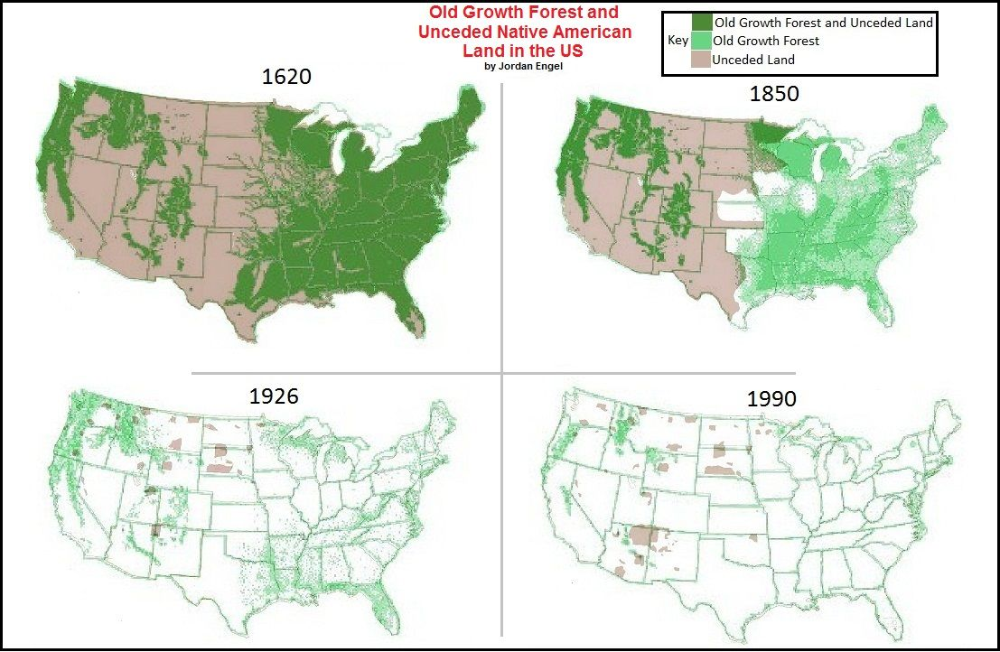
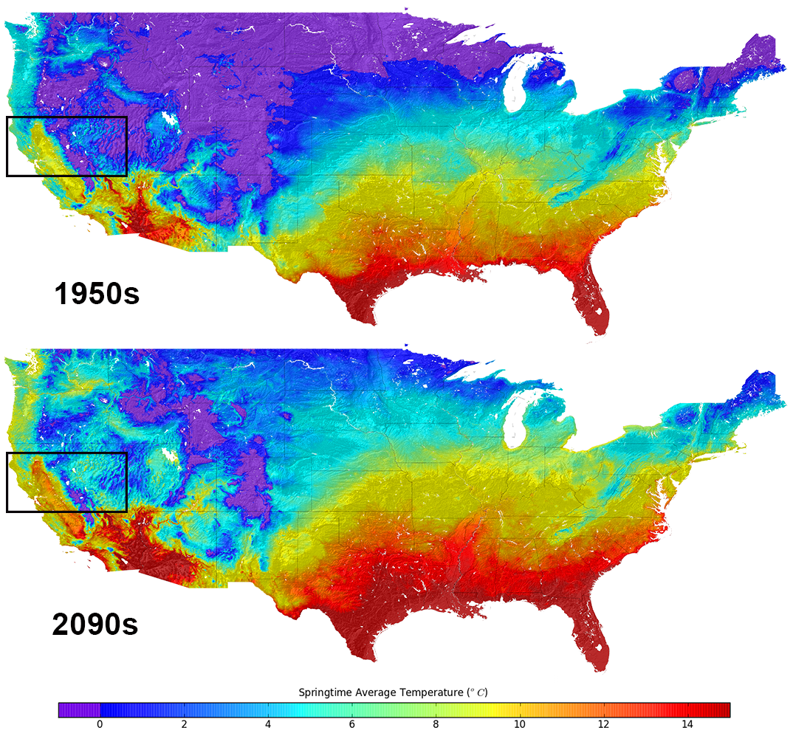

```{r, echo = F}

library(pacman)

p_load(readxl, knitr, extrafont, tidyverse, magrittr, janitor, kableExtra)


```

# Who Am I?


**M. Steven Holloway**

  - Born and raised in Iowa
  
  - Fled to here after earning a BS in Economics and a BS in Finance at Iowa State in 2019
    - Don't ask me for investment advice it all left my head the second I graduated
    
  - Earned my MS in Economics in the process of becoming a doctoral candidate
  
  - Study inequality, the environment, their intersection, and intertemporal decision-making
  
---

# Who Am I?

.pull-left[
  
Have 3 cats, pictured here -->
  
Spend my free time listening to music, playing video games, and enjoying food:

.pink[**Music**]: Magdalena Bay, Charli XCX, 100 gecs, Billy Woods, Ashenspire
    
.purple[**Games**]: Celeste, Vampire Survivors, Diablo II, Valorant, Overwatch
    
.orange[**Food**]: Osteria DOP, Lox Stocks and Bagel, Izakaya Meiji, T4
  ]
  
.pull-right[

]
---

# Syllabus Stuff

Email: marcush@uoregon.edu

<br>

Office: PLC 508

<br>

Office Hours: 1pm Monday and Thursday and by appointment

---

# Required Materials


<br>

<br>

<br>

.biggest[ N/A ]


---

# Grade Breakdown

**Homework: 30%**

**Midterm: 30%**

**Final: 40%**

Final grades will be curved

  - The curve depends on average overall performance of the class
  - Your own position in the distribution of overall scores
  - The curve WILL NOT lower your letter grade
  
---

# Homework


---

# Resource and Environmental Issues

There's a lot. To name a few...

.smaller[

- Climate change
- Deforestation
- Overfishing
- Water scarcity
- Air pollution
- Oil spills
- Endangered species
- Power grid failures
- Provision and funding of national parks
- Floods
- Forest Fires
- Pollen
- Land use
- Conservation
- Environmental Justice
]

---

# Putting the second E in REE

This class is designed to approach these issues through an economic lens

<br>

For those that need a refresher, what is economics?

--

(One of many) Widely accepted definitions: The study of how agents .green[**make choices**] given .red[**scarce resources**] and the .blue[**social results**] of these choices


--

<br>

Defined this way, economics' application to environmental issues comes naturally

---

# Putting the second E in REE

Resource and environmental economics (REE): The application of economics to the study of how environmental and natural resources are managed and allocated

<br>

Examples:
- Determining the value of mitigating pollution

- How agents respond to climate change policies

- Whether tax credits for green energy are cost effective

- How pollution and other negative environmental issues disproportionately impact disadvantaged communities

---

# Air pollution

.pull-left[

Consenus: .red[Not Good].

]

.pull-right[
```{r,echo = F}
include_graphics('airpollutants.png')

```


]
---
count:false

# Air pollution

.pull-left[

Consenus: .red[Not Good].

<br>


Solution: Just don't?

]

.pull-right[
```{r,echo = F}
include_graphics('airpollutants.png')

```


]

---
count:false

# Air pollution

.pull-left[

Consenus: .red[Not Good].

<br>


Solution: Just don't?


Unfortunately, it's not that simple. Many economic activities, namely manufacturing, create air pollution


There exists a *tradeoff* between clean air and the cost of reducing pollution
  - less production means fewer jobs
  - same production with cleaner energy is expensive to achieve
]

.pull-right[
```{r,echo = F}
include_graphics('airpollutants.png')

```


]

---

# Water pollution


### Also Not Good.

<br>

--

### Water pollution reduces the stock of potable water AND damages the habitats and health of other animals.

<br>

--

### Not only are humans directly impacted by increased scarcity of water and food sources, but other organisms also incur the costs of humans' pollution


---

# Overfishing
.pull-left[

Not Good. (Should be apparent by the name)

]

.pull-right[
```{r,echo = F}
include_graphics('overfish.png')

```

]


---
count:false
# Overfishing
.pull-left[

Not Good. (Should be apparent by the name)

<br>


Combined with water pollution, we also catch an inefficiently large amount of fish
]

.pull-right[
```{r,echo = F}
include_graphics('overfish.png')

```

]

---
count:false
# Overfishing

.pull-left[
Not Good. (Should be apparent by the name)


<br>


Combined with water pollution, we also catch an inefficiently large amount of fish


Fish can replenish their population, but only if we don't fish too many

Endangerment and extinction of species can have rippling effects through our ecosystem

How do we stop profit-driven fishing vessels from taking as many fish as they can?
]

.pull-right[
```{r,echo = F}
include_graphics('overfish.png')

```

]

---

# Deforestation
.pull-left[

Not Good. (I'm tired of writing this)


]

.pull-right[
```{r,echo = F}


```

]

---
count:false
# Deforestation
.pull-left[

Not Good. (I'm tired of writing this)

<br>


Humans use timber as an input in many products, including shelter we need to survive


]

.pull-right[
```{r,echo = F}


```

]

---
count:false
# Deforestation
.pull-left[

Not Good. (I'm tired of writing this)

<br>


Humans use timber as an input in many products, including shelter we need to survive

<br>


Trees grow back, but not always as fast as we cut them down, and sometimes we don't even allow them to.

This reduces natural habitats and also impacts the earth's ability to handle excess air pollution.

]

.pull-right[
```{r,echo = F}


```

]

---

# Climate Change

.pull-left[
It's getting hotter (even compared to historical cycles)

<br>


]

.pull-right[

```{r,echo = F}


```
]

---
count:false
# Climate Change

.pull-left[
It's getting hotter (even compared to historical cycles)

<br>


In the short term, this means adapting to slightly higher temperatures


]

.pull-right[

```{r,echo = F}


```
]

---
count:false
# Climate Change

.pull-left[
It's getting hotter (even compared to historical cycles)

<br>


In the short term, this means adapting to slightly higher temperatures


In the long term, this means significant changes to our ecosystem that may surpass our ability to adapt
]

.pull-right[

```{r,echo = F}


```
]

---
count:false
# Climate Change

.pull-left[
It's getting hotter (even compared to historical cycles)

<br>


In the short term, this means adapting to slightly higher temperatures


In the long term, this means significant changes to our ecosystem that may surpass our ability to adapt


Human activities are in large part causing this; how do we change our behavior to fix what we can and survive what we can't?
]

.pull-right[

```{r,echo = F}


```
]

---

# Weather

It's getting more extreme

<br>

--

Floods are occurring more often

<br> 

Droughts are occurring more often and for longer

<br>

More land is at risk of wildfire

--

Each kind of natural disaster has its own set of adaptations and costs associated


---

# Inequality

.pull-left[
These issues are disproportionate in their impact

<br>


]
.pull-right[

```{r,echo = F}
include_graphics('incwhite.png')
include_graphics('blackhis.png')
```


]

---
count:false
# Inequality

.pull-left[
These issues are disproportionate in their impact

<br>


Less fortunate people can't afford the costs of adaptation

<br>

Even when controlling for income and education, POC are more impacted by pollution and poor air quality
]
.pull-right[

```{r,echo = F}
include_graphics('incwhite.png')
include_graphics('blackhis.png')
```


]


---

# Inequality

<br>

.center[

```{r,echo = F}
include_graphics('zill.png')
```


]

---
# How Do We Approach These Issues?

<br>

.bigger[
Traditional Economic Approach

- Use neoclassical economic theory(e.g., Supply and Demand, Marginal Valuations, etc.) to gain insights into environmental issues

]

<br>

This is what we will focus on (gotta start somewhere)

---

# Another option

<br>

Ecological Economics Approach
  - Perspective based on the assumption that our economic system is only a subset of the broader ecosystem

<br>

This approach is also valid, but has not received as much attention

---

# The Invisible, Incompetent Hand

Basic supply and demand models rely on what Adam Smith coined 'the Invisble Hand' of the market

<br>

--
This was his metaphor for the forces of human behavior that drive markets to equilibrium - free of government intervention

<br>

--

Even Adam Smith himself realized this does not apply to all contexts, though


---

# The Invisible, Incompetent Hand


The invisible hand requires strong assumptions, such as finite valuation of the goods and well-defined property rights

<br>

--

Adam Smith realized the shortcomings of his model and advised against the use of markets for healthcare and housing - invaluable resources

<br>

--

Clean air, water, natural habitats, safety from disasters, etc. are all hard to evaluate, and have no natural property rights

---

# The Invisible, Incompetent Hand

Equilibrium in Supply and Demand models, even when achieved only guarantee .red[**efficiency**].footnote[Efficiency means lack of waste, or maximizing value given constraints]

<br>

--

Efficiency is not always the most attractive outcome, though

<br>

--

As a society, we may prefer a slightly smaller pie if it means some people get a bigger piece than before

<br>

This efficiency vs equity tradeoff is key to modern economic policy considerations


---
# This Class

In this class we will learn how to maneuver the shortcomings of traditional economics to answer questions about resources and the environment and what interventions are appropriate

<br>

We will cover:

Externalities - the costs or benefits borne to agents not taking part in a transaction
  - Pollution, climate change, over-extraction

Public Goods - Goods that are not owned or controlled by any given agent
  - Fisheries, Forests, Groundwater
  
Intertemporal decision-making
  - Optimal resource extraction, valuation of environmental goods

Inequality stemming from the above

---

#This Class

<br>

.biggest[

Goal: Understand the issues facing humanity in regards to natural resources and the environment through an economic lens. Apply foundational economic knowledge to arrive at policies and behavioral adaptations that can mitigate these issues and the damage they cause to society.


]

---

# Wrap-Up

Summary: If we exist in an equilibrium it is does not seem to be a healthy one. Understanding the issues we face and intervening intelligently can help us reach a better one.

<br>

Next class: EC 201 Review


