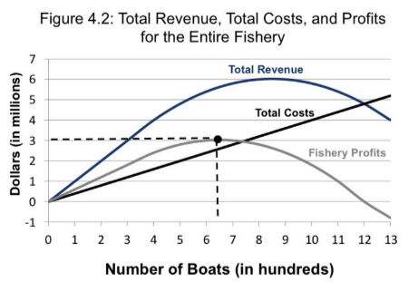
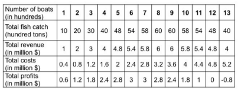
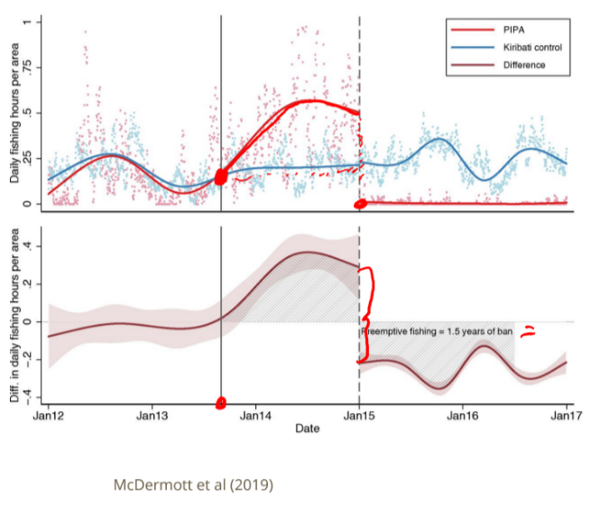
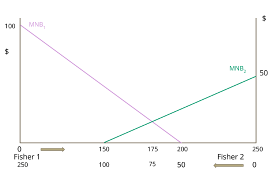

```{r Setup, include = F}
library(pacman)
p_load(ggthemes, readxl, viridis, knitr, dslabs, extrafont, Ecdat, tidyverse, magrittr, janitor, kableExtra)
# Define colors
red_pink <- "#e64173"
met_slate <- "#272822" # metropolis font color 
purple <- "#9370DB"
green <- "#007935"
light_green <- "#7DBA97"
orange <- "#FD5F00"
turquoise <- "#44C1C4"
red <- "#b92e34"
# Knitr options
opts_chunk$set(
  fig.align = "center",
  fig.height = 10,
  fig.width = 10.5,
  #dpi = 300,
  #cache = T,
  warning = F,
  message = F
)  
theme_simple <- theme_bw() + theme(
  axis.line = element_line(color = met_slate),
  panel.grid = element_blank(),
  rect = element_blank(),
  strip.text = element_blank(),
  text = element_text(family = "Fira Sans", color = met_slate, size = 17),
  axis.text.x = element_text(size = 16),
  axis.text.y = element_text(size = 16)
)
theme_market <- theme_bw() + theme(
  axis.line = element_line(color = met_slate),
  panel.grid = element_blank(),
  rect = element_blank(),
  strip.text = element_blank(),
  text = element_text(family = "Fira Sans", color = met_slate, size = 17),
  axis.title.x = element_text(hjust = 1, size = 17),
  axis.title.y = element_text(hjust = 1, angle = 0, size = 17),
  # axis.text.x = element_text(size = 12),
  # axis.text.y = element_text(size = 12),
  axis.ticks = element_blank()
)
theme_gif <- theme_bw() + theme(
  axis.line = element_line(color = met_slate),
  panel.grid = element_blank(),
  rect = element_blank(),
  text = element_text(family = "Fira Sans", color = met_slate, size = 17),
  axis.text.x = element_text(size = 12),
  axis.text.y = element_text(size = 12),
  axis.ticks = element_blank()
)
wrapper <- function(x, ...) paste(strwrap(x, ...), collapse = "\n")
# functions
demand <- function(x) 10 - x
demand_2 <- function(x) 9 - x
demand_3 <- function(x) 8 - x
demand_inc <- function(x) 11 - x
demand_dec <- function(x) 5 - x
supply <- function(x) 2 + 2*x
step_demand <- data.frame(x = c(0, 1, 2, 3, 4, 5, 6, 7, 8), mv = c(8, 7, 6, 5, 4, 3, 2, 1, 0))
```


# Introduction

 - Starting this week: .green[**Actual environment issues!!**]

<br>

 - With background theory established we can now talk about

    - **Fisheries**
  
    - Forests
  
    - Water
  
    - Pollution


---

# Fish

One of the most intuitive examples of an open-access resource is fish

<br>

They provide sustenance to humans, but without government intervention, no one owns a fish before they catch it - they're **non-excludable**

<br>

Since they live in vast bodies of water, it's hard to keep track of just how many there are and who is catching them

<br>

They also have value beyond human sustenance - they are part of a broader ecosystem that humans don't directly engage with

---

# The Problem

.blue[**Overfishing**] - Level of fishing that depletes stock of fish or negatively impacts welfare or the ecosystem


<br>

Humans may *overfish* relative to the social optimum because they do not feel the cost to others or to the ecosystem they are fishing from

  - non-excludable resources are subject to the **Tragedy of the Commons**
  
  - absent government intervention, traditional market logic leads to over-expansion of production(fishing) and strains resources
---

# The Problem

Examples?

--

Increased search costs for other fishers, increased pollution to water due to increased search time, 

poorer quality catch for consumers of other fishers, poorer fish and other wildlife health, increased search cost of mating for wildlife, 

extinction of fished species, decreased biodiversity in ecosystem, etc.


---

# Fisheries

.smaller[
In resource economics we often focus on **Fisheries**

Definition: A geographic area that is associated with a population of aquatic organisms that are harvested for commercial or recreational use

<br>

Instead of studying the entire ocean, we study places we know fish and people will be

<br> 

In particular, this allows us to study *Demersal* fish species (groundfish).footnote[For those interested, other species are *Pelagic*. They migrate over wide areas making universal property rights hard to assign]

  - They feed on the ocean floor and stay in the same area
  
  - This mean private property rights are more easily assignable to these kinds of populations
  ]
  
---

# Bioeconomic model of a Fishery

.pull-left[

```{r, echo = FALSE, fig.height = 5, fig.width = 5, dev = "svg"}
x <- 0:10
ext <- 3

MSY <- function(x) -(1/5)*(x-5)^2 + 5

MSYseq = seq(0,10, 0.01)


base <- ggplot() +
  scale_x_continuous(limits = c(0, 10.5), expand = c(0, 0), breaks =c(0, 5, 10), labels = c(0,expression(X_MSY), expression(K))) +
  scale_y_continuous(limits = c(0, 10.5), expand = c(0, 0), breaks = c(0, 5, 10), labels = c(0,expression(G(X_MSY)),expression(.))) +
  labs(x = "Biomass", y = "G(X)") +
  theme_market
base +
  stat_function(aes(x=0), fun = MSY, color = red_pink, size = 1) + # demand function
  annotate("text", label = expression(MSY), x = 9, y = 3, color = red_pink, family = "Fira Sans", size = 6) +
  geom_segment(aes(x = 5, y = 0, xend = 5, yend = 5), linetype  = "dashed", color = met_slate, size = 1) +
  geom_segment(aes(x = 0, y = 5, xend = 5, yend = 5), linetype  = "dashed", color = met_slate, size = 1) + 
  geom_point(aes(x = 5, y = 5), color = met_slate, size = 2)
```


]


.pull-right[
The Schaefer logistic model for growth describes the incremental growth in a fish stock as a function of the size of the stock

$X_{MSY}$ describes the stock level of fish where stock growth, $G(X_{MSY})$ is greatest

$G(X_{MSY})$ is referred to as .pink[**MSY**]- Maximum Sustainable Yield - the most a fish population can grow given ecological constraints

This is partially based on $K$, the carrying capacity of the ecosystem
]

---

# Bionomic Equilibrium

One question we might ask: How much can we harvest without causing a population decrease?

<br>

If fish stock currently = 1,000 and they're growing at 10% per year, how many fish can you harvest without decreasing the stock?

--

<br>

Answer: 10% of 1,000, or 100 fish


This is called the .blue[**Bionomic Equilibrium**]: equilibrium where population size doesn't change because quantity harvest is exactly equal to the amount the fishery grows by

---

# Bionomic Equilibrium

.pull-left[

```{r, echo = FALSE, fig.height = 6, fig.width = 6, dev = "svg"}
x <- 0:10
ext <- 3

MSY <- function(x) -(1/5)*(x-5)^2 + 5

MSYseq = seq(0,10, 0.01)


base <- ggplot() +
  scale_x_continuous(limits = c(0, 10.5), expand = c(0, 0), breaks =c(0,5- sqrt(10), 5,sqrt(10) + 5, 10), labels = c(0, "X'",expression(X_MSY),'X"', expression(K)))+
  scale_y_continuous(limits = c(0, 10.5), expand = c(0, 0), breaks = c(0, 3, 5, 10), labels = c(0,expression(H),expression(G(X_MSY)),expression(.))) +
  labs(x = "Biomass", y = "G(X)") +
  theme_market
base +
  stat_function(aes(x=0), fun = MSY, color = red_pink, size = 1) + # demand function
  annotate("text", label = expression(MSY), x = 9, y = 3.3, color = red_pink, family = "Fira Sans", size = 6) +
  geom_segment(aes(x = 5, y = 0, xend = 5, yend = 5), linetype  = "dashed", color = met_slate, size = 1) +
  geom_segment(aes(x = 0, y = 5, xend = 5, yend = 5), linetype  = "dashed", color = met_slate, size = 1) + 
  geom_point(aes(x = 5, y = 5), color = met_slate, size = 2)+
  geom_segment(aes(x = 0, y = 3, xend = 10, yend = 3), linetype  = "dashed", color = met_slate, size = 1)+
  geom_point(aes(x = 5- sqrt(10), y = 3), color = green, size = 2)+
  geom_point(aes(x = sqrt(10) + 5, y = 3), color = green, size = 2)+
  geom_segment(aes(x = 5- sqrt(10), y = 0, xend = 5- sqrt(10), yend = 3), linetype  = "dashed", color = met_slate, size = 1)+
  geom_segment(aes(x = 5 + sqrt(10), y = 0, xend = 5 +sqrt(10), yend = 3), linetype  = "dashed", color = met_slate, size = 1)
```

]


.pull-right[

Any point (growth rate and stock pair) on the curve can be a bionic equilibrium

H is level of harvest (Suppose it's 10%)

Then there are **TWO** potential equilibrium stocks: X' and X''

]


---


# Bionomic Equilibrium

.pull-left[

```{r, echo = FALSE, fig.height = 6, fig.width = 6, dev = "svg"}
x <- 0:10
ext <- 3

MSY <- function(x) -(1/5)*(x-5)^2 + 5

MSYseq = seq(0,10, 0.01)


base <- ggplot() +
  scale_x_continuous(limits = c(0, 10.5), expand = c(0, 0), breaks =c(0,5- sqrt(10), 5,sqrt(10) + 5, 10), labels = c(0, "X'",expression(X_MSY),'X"', expression(K)))+
  scale_y_continuous(limits = c(0, 10.5), expand = c(0, 0), breaks = c(0, 3, 5, 10), labels = c(0,expression(H),expression(G(X_MSY)),expression(.))) +
  labs(x = "Biomass", y = "G(X)") +
  theme_market
base +
  stat_function(aes(x=0), fun = MSY, color = red_pink, size = 1) + # demand function
  annotate("text", label = expression(MSY), x = 9, y = 3.3, color = red_pink, family = "Fira Sans", size = 6) +
  geom_segment(aes(x = 5, y = 0, xend = 5, yend = 5), linetype  = "dashed", color = met_slate, size = 1) +
  geom_segment(aes(x = 0, y = 5, xend = 5, yend = 5), linetype  = "dashed", color = met_slate, size = 1) + 
  geom_point(aes(x = 5, y = 5), color = met_slate, size = 2)+
  geom_segment(aes(x = 0, y = 3, xend = 10, yend = 3), linetype  = "dashed", color = met_slate, size = 1)+
  geom_point(aes(x = 5- sqrt(10), y = 3), color = green, size = 2)+
  geom_point(aes(x = sqrt(10) + 5, y = 3), color = green, size = 2)+
  geom_segment(aes(x = 5- sqrt(10), y = 0, xend = 5- sqrt(10), yend = 3), linetype  = "dashed", color = met_slate, size = 1)+
  geom_segment(aes(x = 5 + sqrt(10), y = 0, xend = 5 +sqrt(10), yend = 3), linetype  = "dashed", color = met_slate, size = 1)
```

]


.pull-right[

MSY is maximum sustainable yield and $X_{MSY}$ is the biomass level that gives that yield

<br>

At any harvest level *below* MSY, we'll have two potential equilibria

<br>

Is one better than the other?

]


---


# Bionomic Equilibrium

.pull-left[

```{r, echo = FALSE, fig.height = 6, fig.width = 6, dev = "svg"}
x <- 0:10
ext <- 3

MSY <- function(x) -(1/5)*(x-5)^2 + 5

MSYseq = seq(0,10, 0.01)


base <- ggplot() +
  scale_x_continuous(limits = c(0, 10.5), expand = c(0, 0), breaks =c(0,5- sqrt(10), 5,sqrt(10) + 5, 10), labels = c(0, "X'",expression(X_MSY),'X"', expression(K)))+
  scale_y_continuous(limits = c(0, 10.5), expand = c(0, 0), breaks = c(0, 3, 5, 10), labels = c(0,expression(H),expression(G(X_MSY)),expression(.))) +
  labs(x = "Biomass", y = "G(X)") +
  theme_market
base +
  stat_function(aes(x=0), fun = MSY, color = red_pink, size = 1) + # demand function
  annotate("text", label = expression(MSY), x = 9, y = 3.3, color = red_pink, family = "Fira Sans", size = 6) +
  geom_segment(aes(x = 5, y = 0, xend = 5, yend = 5), linetype  = "dashed", color = met_slate, size = 1) +
  geom_segment(aes(x = 0, y = 5, xend = 5, yend = 5), linetype  = "dashed", color = met_slate, size = 1) + 
  geom_point(aes(x = 5, y = 5), color = met_slate, size = 2)+
  geom_segment(aes(x = 0, y = 3, xend = 10, yend = 3), linetype  = "dashed", color = met_slate, size = 1)+
  geom_point(aes(x = 5- sqrt(10), y = 3), color = green, size = 2)+
  geom_point(aes(x = sqrt(10) + 5, y = 3), color = green, size = 2)+
  geom_segment(aes(x = 5- sqrt(10), y = 0, xend = 5- sqrt(10), yend = 3), linetype  = "dashed", color = met_slate, size = 1)+
  geom_segment(aes(x = 5 + sqrt(10), y = 0, xend = 5 +sqrt(10), yend = 3), linetype  = "dashed", color = met_slate, size = 1)+
  geom_segment(aes(x = 5 , y = 7, xend = 1, yend = 7), linetype  = "solid", color = met_slate, size = 1,arrow = arrow())
```

]


.pull-right[

Any harvest level *to the left* of MSY is .green[**biologically inefficient**]

<br>

There will always be a corresponding stock level *to the right* of MSY that ensures a higher level of fish stock for the same percentage harvest level

<br>

Higher levels of production AND more fish in the sea

]


---


# Bionomic Equilibrium

.pull-left[

```{r, echo = FALSE, fig.height = 6, fig.width = 6, dev = "svg"}
x <- 0:10
ext <- 3

MSY <- function(x) -(1/5)*(x-5)^2 + 5

MSYseq = seq(0,10, 0.01)


base <- ggplot() +
  scale_x_continuous(limits = c(0, 10.5), expand = c(0, 0), breaks =c(0, 5, 10), labels = c(0,expression(X_MSY),expression(K)))+
  scale_y_continuous(limits = c(0, 10.5), expand = c(0, 0), breaks = c(0, 5,8, 10), labels = c(0,expression(G(X_MSY)),expression(H),expression(.))) +
  labs(x = "Biomass", y = "G(X)") +
  theme_market
base +
  stat_function(aes(x=0), fun = MSY, color = red_pink, size = 1) + # demand function
  annotate("text", label = expression(MSY), x = 9, y = 3.3, color = red_pink, family = "Fira Sans", size = 6) +
  geom_segment(aes(x = 5, y = 0, xend = 5, yend = 5), linetype  = "dashed", color = met_slate, size = 1) +
  geom_segment(aes(x = 0, y = 5, xend = 5, yend = 5), linetype  = "dashed", color = met_slate, size = 1) + 
  geom_point(aes(x = 5, y = 5), color = met_slate, size = 2)+
  geom_segment(aes(x = 0, y = 8, xend = 10, yend = 8), linetype  = "dashed", color = met_slate, size = 1)
  #geom_point(aes(x = 5- sqrt(10), y = 3), color = green, size = 2)+
  #geom_point(aes(x = sqrt(10) + 5, y = 3), color = green, size = 2)+
  #geom_segment(aes(x = 5- sqrt(10), y = 0, xend = 5- sqrt(10), yend = 3), linetype  = "dashed", color = met_slate, size = 1)+
  #geom_segment(aes(x = 5 + sqrt(10), y = 0, xend = 5 +sqrt(10), yend = 3), linetype  = "dashed", color = met_slate, size = 1)+
  #geom_segment(aes(x = 5 , y = 7, xend = 1, yend = 7), linetype  = "solid", color = met_slate, size = 1,arrow = arrow())
```

]


.pull-right[

What if H is set above MSY??

]


---


# Bionomic Equilibrium

.pull-left[

```{r, echo = FALSE, fig.height = 6, fig.width = 6, dev = "svg"}
x <- 0:10
ext <- 3

MSY <- function(x) -(1/5)*(x-5)^2 + 5

MSYseq = seq(0,10, 0.01)


base <- ggplot() +
  scale_x_continuous(limits = c(0, 10.5), expand = c(0, 0), breaks =c(0, 5, 10), labels = c(0,expression(X_MSY),expression(K)))+
  scale_y_continuous(limits = c(0, 10.5), expand = c(0, 0), breaks = c(0, 5,8, 10), labels = c(0,expression(G(X_MSY)),expression(H),expression(.))) +
  labs(x = "Biomass", y = "G(X)") +
  theme_market
base +
  stat_function(aes(x=0), fun = MSY, color = red_pink, size = 1) + # demand function
  annotate("text", label = expression(MSY), x = 9, y = 3.3, color = red_pink, family = "Fira Sans", size = 6) +
  geom_segment(aes(x = 5, y = 0, xend = 5, yend = 5), linetype  = "dashed", color = met_slate, size = 1) +
  geom_segment(aes(x = 0, y = 5, xend = 5, yend = 5), linetype  = "dashed", color = met_slate, size = 1) + 
  geom_point(aes(x = 5, y = 5), color = met_slate, size = 2)+
  geom_segment(aes(x = 0, y = 8, xend = 10, yend = 8), linetype  = "dashed", color = met_slate, size = 1)+
  #geom_point(aes(x = 5- sqrt(10), y = 3), color = green, size = 2)+
  #geom_point(aes(x = sqrt(10) + 5, y = 3), color = green, size = 2)+
  #geom_segment(aes(x = 5- sqrt(10), y = 0, xend = 5- sqrt(10), yend = 3), linetype  = "dashed", color = met_slate, size = 1)+
  #geom_segment(aes(x = 5 + sqrt(10), y = 0, xend = 5 +sqrt(10), yend = 3), linetype  = "dashed", color = met_slate, size = 1)+
  geom_segment(aes(x = 5 , y = 0.5, xend = 0, yend = 0.5), linetype  = "solid", color = met_slate, size = 1,arrow = arrow())
```

]


.pull-right[

What if H is set above MSY??

<br>

Regardless of starting population, the fish stock will eventually be depleted

<br>

If we harvest at a rate greater than the fish can ever reproduce at, they'll never be able to catch up

]

---

# Harvest Function

.pull-left[

```{r, echo = FALSE, fig.height = 6, fig.width = 6, dev = "svg"}
x <- 0:10
ext <- 3

MSY <- function(x) -(1/5)*(x-5)^2 + 5

Harv = function(x) (1/4)*x

MSYseq = seq(0,10, 0.01)


base <- ggplot() +
  scale_x_continuous(limits = c(0, 10.5), expand = c(0, 0), breaks =c(0, 5, 10), labels = c(0,expression(X_MSY),expression(K)))+
  scale_y_continuous(limits = c(0, 10.5), expand = c(0, 0), breaks = c(0, 5, 10), labels = c(0,expression(G(X_MSY)),expression(.))) +
  labs(x = "Biomass", y = "G(X)") +
  theme_market
base +
  stat_function(aes(x=0), fun = MSY, color = red_pink, size = 1) + # demand function
  stat_function(aes(x=0), fun = Harv, color = orange, size = 1) +
  #annotate("text", label = expression(MSY), x = 9, y = 3.3, color = red_pink, family = "Fira Sans", size = 6) +
  annotate("text", label = expression('H = G(E,X)'), x = 9, y = 2.6, color = orange, family = "Fira Sans", size = 5) +
  geom_segment(aes(x = 5, y = 0, xend = 5, yend = 5), linetype  = "dashed", color = met_slate, size = 1) +
  geom_segment(aes(x = 0, y = 5, xend = 5, yend = 5), linetype  = "dashed", color = met_slate, size = 1) + 
  geom_point(aes(x = 5, y = 5), color = met_slate, size = 2)
  #geom_segment(aes(x = 0, y = 8, xend = 10, yend = 8), linetype  = "dashed", color = met_slate, size = 1)
  #geom_point(aes(x = 5- sqrt(10), y = 3), color = green, size = 2)+
  #geom_point(aes(x = sqrt(10) + 5, y = 3), color = green, size = 2)+
  #geom_segment(aes(x = 5- sqrt(10), y = 0, xend = 5- sqrt(10), yend = 3), linetype  = "dashed", color = met_slate, size = 1)+
  #geom_segment(aes(x = 5 + sqrt(10), y = 0, xend = 5 +sqrt(10), yend = 3), linetype  = "dashed", color = met_slate, size = 1)+
  #geom_segment(aes(x = 5 , y = 0.5, xend = 0, yend = 0.5), linetype  = "solid", color = met_slate, size = 1,arrow = arrow())
```

]


.pull-right[
Firms have to balance the costs involved with fishing with the natural growth rate of the ecosystem

<br>

In particular, let E stand for **Effort**, a combination of capital, labor, materials, and energy (number of fishers, boat-days, traps, etc)

<br>

The amount harvested each period is determined by a function of this effort and the stock size of the fish, X

 .center[ 
 $H = G(E,X)$
 ]

]

---

# Harvest Function

.pull-left[

```{r, echo = FALSE, fig.height = 6, fig.width = 6, dev = "svg", warning = F}
x <- 0:10
ext <- 3

MSY <- function(x) -(1/5)*(x-5)^2 + 5

Harv = function(x) (1/4)*x

Harv2 = function(x) 1.2*x

MSYseq = seq(0,10, 0.01)


base <- ggplot() +
  scale_x_continuous(limits = c(0, 10.5), expand = c(0, 0), breaks =c(0, 5, 10), labels = c('E = 0 ',expression(E_MSY),expression(E_max)))+
  scale_y_continuous(limits = c(0, 10.5), expand = c(0, 0), breaks = c(0, 2.1, 5, 10), labels = c(0,expression(H),expression(MSY),expression(.))) +
  labs(x = "Effort", y = "Harvest H(E)") +
  theme_market
base +
  stat_function(aes(x=0), fun = MSY, color = red_pink, size = 1) + # demand function
  stat_function(aes(x=0), fun = Harv, color = orange, size = 1) +
  #annotate("text", label = expression(MSY), x = 9, y = 3.3, color = red_pink, family = "Fira Sans", size = 6) +
  annotate("text", label = expression('H = G(E,X)'), x = 9, y = 2.6, color = orange, family = "Fira Sans", size = 5) +
  geom_segment(aes(x = 5, y = 0, xend = 5, yend = 5), linetype  = "dashed", color = met_slate, size = 1) +
  geom_segment(aes(x = 0, y = 5, xend = 5, yend = 5), linetype  = "dashed", color = met_slate, size = 1) + 
  geom_point(aes(x = 5, y = 5), color = met_slate, size = 2)+
  geom_segment(aes(x = 0, y = 2.15, xend = 8.8, yend = 2.15), linetype  = "dashed", color = met_slate, size = 1)
  #geom_point(aes(x = 5- sqrt(10), y = 3), color = green, size = 2)+
  #geom_point(aes(x = sqrt(10) + 5, y = 3), color = green, size = 2)+
  #geom_segment(aes(x = 5- sqrt(10), y = 0, xend = 5- sqrt(10), yend = 3), linetype  = "dashed", color = met_slate, size = 1)+
  #geom_segment(aes(x = 5 + sqrt(10), y = 0, xend = 5 +sqrt(10), yend = 3), linetype  = "dashed", color = met_slate, size = 1)+
  #geom_segment(aes(x = 5 , y = 0.5, xend = 0, yend = 0.5), linetype  = "solid", color = met_slate, size = 1,arrow = arrow())
```

]


.pull-right[
Now we have to consider effort in our bionomic equilibrium

<br>

If harvest occurs to the right of $E_{MSY}$, it is .purple[**economically inefficient**]

<br>

Why?
]

---

# Harvest Function

.pull-left[

```{r, echo = FALSE, fig.height = 6, fig.width = 6, dev = "svg"}
x <- 0:10
ext <- 3

MSY <- function(x) -(1/5)*(x-5)^2 + 5

Harv = function(x) (1/4)*x

Harv2 = function(x) 1.8*x

MSYseq = seq(0,10, 0.01)


base <- ggplot() +
  scale_x_continuous(limits = c(0, 10.5), expand = c(0, 0), breaks =c(0, 5, 8.8,10), labels = c('E = 0',expression(E_MSY),'.',expression(E_max)))+
  scale_y_continuous(limits = c(0, 10.5), expand = c(0, 0), breaks = c(0,2.1, 5, 10), labels = c(0,expression(H),expression(MSY),expression(.))) +
  labs(x = "Effort", y = "Harvest H(E)") +
  theme_market
base +
  stat_function(aes(x=0), fun = MSY, color = red_pink, size = 1) + # demand function
  stat_function(aes(x=0), fun = Harv, color = orange, size = 1) +
  stat_function(aes(x=0), fun = Harv2, color = orange, size = 1) +
  #annotate("text", label = expression(MSY), x = 9, y = 3.3, color = red_pink, family = "Fira Sans", size = 6) +
  annotate("text", label = expression('More work'), x = 9, y = 3.2, color = orange, family = "Fira Sans", size = 5) +
  annotate("text", label = expression('Less work'), x = 3, y =7.8, color = orange, family = "Fira Sans", size = 5) +
  geom_segment(aes(x = 5, y = 0, xend = 5, yend = 5), linetype  = "dashed", color = met_slate, size = 1) +
  geom_segment(aes(x = 0, y = 5, xend = 5, yend = 5), linetype  = "dashed", color = met_slate, size = 1) + 
  geom_point(aes(x = 5, y = 5), color = met_slate, size = 2)+
  geom_segment(aes(x = 0, y = 2.15, xend = 8.8, yend = 2.15), linetype  = "dashed", color = met_slate, size = 1)+
  geom_point(aes(x = 1.18, y = 2.15), color = green, size = 2)+
  geom_point(aes(x = 8.8, y = 2.15), color = green, size = 2)
  #geom_segment(aes(x = 5- sqrt(10), y = 0, xend = 5- sqrt(10), yend = 3), linetype  = "dashed", color = met_slate, size = 1)+
  #geom_segment(aes(x = 5 + sqrt(10), y = 0, xend = 5 +sqrt(10), yend = 3), linetype  = "dashed", color = met_slate, size = 1)+
  #geom_segment(aes(x = 5 , y = 0.5, xend = 0, yend = 0.5), linetype  = "solid", color = met_slate, size = 1,arrow = arrow())
```

]


.pull-right[
There will always be a lower level of effort that could achieve the same harvest

<br>

The firm harvests less fish, but also incurs significantly less cost

<br>


]

---

# Conflicting Interests

.pull-left[

.center[Bionomic Model: Any point to the left of X_MSY is **biologically inefficient**]

```{r, echo = FALSE, fig.height = 4.5, fig.width = 5, dev = "svg"}
x <- 0:10
ext <- 3

MSY <- function(x) -(1/5)*(x-5)^2 + 5

MSYseq = seq(0,10, 0.01)


base <- ggplot() +
  scale_x_continuous(limits = c(0, 10.5), expand = c(0, 0), breaks =c(0,5- sqrt(10), 5,sqrt(10) + 5, 10), labels = c(0, "X'",expression(X_MSY),'X"', expression(K)))+
  scale_y_continuous(limits = c(0, 10.5), expand = c(0, 0), breaks = c(0, 3, 5, 10), labels = c(0,expression(H),expression(G(X_MSY)),expression(.))) +
  labs(x = "Biomass", y = "G(X)") +
  theme_market
base +
  stat_function(aes(x=0), fun = MSY, color = red_pink, size = 1) + # demand function
  annotate("text", label = expression(MSY), x = 9, y = 3.3, color = red_pink, family = "Fira Sans", size = 6) +
  geom_segment(aes(x = 5, y = 0, xend = 5, yend = 5), linetype  = "dashed", color = met_slate, size = 1) +
  geom_segment(aes(x = 0, y = 5, xend = 5, yend = 5), linetype  = "dashed", color = met_slate, size = 1) + 
  geom_point(aes(x = 5, y = 5), color = met_slate, size = 2)+
  geom_segment(aes(x = 0, y = 3, xend = 10, yend = 3), linetype  = "dashed", color = met_slate, size = 1)+
  geom_point(aes(x = 5- sqrt(10), y = 3), color = green, size = 2)+
  geom_point(aes(x = sqrt(10) + 5, y = 3), color = green, size = 2)+
  geom_segment(aes(x = 5- sqrt(10), y = 0, xend = 5- sqrt(10), yend = 3), linetype  = "dashed", color = met_slate, size = 1)+
  geom_segment(aes(x = 5 + sqrt(10), y = 0, xend = 5 +sqrt(10), yend = 3), linetype  = "dashed", color = met_slate, size = 1)+
  geom_segment(aes(x = 5 , y = 8, xend = 1, yend = 8), linetype  = "solid", color = met_slate, size = 1,arrow = arrow())
```

]


.pull-right[

.center[Effort model: Any point to the right of E_MSY is **economically inefficient**]

```{r, echo = FALSE, fig.height = 4.5, fig.width = 5, dev = "svg", warning = F}
x <- 0:10
ext <- 3

MSY <- function(x) -(1/5)*(x-5)^2 + 5

Harv = function(x) (1/4)*x

Harv2 = function(x) 1.2*x

MSYseq = seq(0,10, 0.01)


base <- ggplot() +
  scale_x_continuous(limits = c(0, 10.5), expand = c(0, 0), breaks =c(0, 5, 10), labels = c('E = 0 ',expression(E_MSY),expression(E_max)))+
  scale_y_continuous(limits = c(0, 10.5), expand = c(0, 0), breaks = c(0, 2.1, 5, 10), labels = c(0,expression(H),expression(MSY),expression(.))) +
  labs(x = "Effort", y = "Harvest H(E)") +
  theme_market
base +
  stat_function(aes(x=0), fun = MSY, color = red_pink, size = 1) + # demand function
  stat_function(aes(x=0), fun = Harv, color = orange, size = 1) +
  #annotate("text", label = expression(MSY), x = 9, y = 3.3, color = red_pink, family = "Fira Sans", size = 6) +
  annotate("text", label = expression('H = G(E,X)'), x = 9, y = 2.6, color = orange, family = "Fira Sans", size = 5) +
  geom_segment(aes(x = 5, y = 0, xend = 5, yend = 5), linetype  = "dashed", color = met_slate, size = 1) +
  geom_segment(aes(x = 0, y = 5, xend = 5, yend = 5), linetype  = "dashed", color = met_slate, size = 1) + 
  geom_point(aes(x = 5, y = 5), color = met_slate, size = 2)+
  geom_segment(aes(x = 0, y = 2.15, xend = 8.8, yend = 2.15), linetype  = "dashed", color = met_slate, size = 1)+
  #geom_point(aes(x = 5- sqrt(10), y = 3), color = green, size = 2)+
  #geom_point(aes(x = sqrt(10) + 5, y = 3), color = green, size = 2)+
  #geom_segment(aes(x = 5- sqrt(10), y = 0, xend = 5- sqrt(10), yend = 3), linetype  = "dashed", color = met_slate, size = 1)+
  #geom_segment(aes(x = 5 + sqrt(10), y = 0, xend = 5 +sqrt(10), yend = 3), linetype  = "dashed", color = met_slate, size = 1)+
  geom_segment(aes(x = 5 , y = 8, xend = 9, yend = 8), linetype  = "solid", color = met_slate, size = 1,arrow = arrow())
```


]

---

# Economics of a Fishery

.pull-left[
```{r, echo = FALSE, fig.height = 5, fig.width = 5, dev = "svg"}
x <- 0:10
z <- seq(0, 2.67, 0.01)
w <- seq(2.67, 5.68, 0.01)
u <- seq(5.68, 7.5, 0.01)
total_product <- function(x) 3*x - 0.5*x^3 + 4*x^2 

ggplot() +
  scale_x_continuous(limits = c(0, 7.5), expand=c(0,0), breaks = seq(0,7,1)) +
  scale_y_continuous(limits = c(0, 65), expand=c(0,0), breaks = seq(0,60,10)) +
  #theme_market +
  xlab('Number of boats(in hundreds)')+
  ylab('Total Product(in hundreds of tons of fish)')+
  theme(axis.text.x=element_text(angle=90),
       axis.text.y= element_text(angle=90))+
  stat_function(aes(x = 0), fun = total_product, color = purple, size = 1) +
  geom_vline(xintercept = 2.67, color = met_slate, size = 1, linetype = "dashed") +
  geom_vline(xintercept = 5.68, color = met_slate, size = 1, linetype = "dashed") +
  annotate("label", label = wrapper("Increasing Returns", 15), x = 2.67/2, y = 58.5, color = purple, family = "Fira Sans", size = 4) +
  annotate("label", label = wrapper("Diminishing Returns", 15), x = (2.67 + 5.68)/2, y = 58.5, color = purple, family = "Fira Sans", size = 4) +
  annotate("label", label = wrapper("Absolutely Diminishing Returns", 15), x = (7.5 + 5.68)/2, y = 58.5, color = purple, family = "Fira Sans", size = 4)
  #geom_ribbon(aes(x = z, ymin = 0, ymax = 65), fill = purple, alpha = 0.2, linetype = "blank") + # PS
  #geom_ribbon(aes(x = u, ymin = 0, ymax = 65), fill = purple, alpha = 0.2, linetype = "blank")
```
]

.pull-right[
So far we've thought of the firm as acting on their own

<br> 

But we know fish are an open-access resource that many firms want to extract

<br>

This is where the Tragedy of the Commmons comes into play - How do firms optimize their effort when other firms will try to do the same to maximize their harvest?
]

---

# Production Theory

Remember that competitive firms maximize profit when Marginal Revenue (MR) = Marginal Cost (MC)

<br>

In a perfectly competitive market, Price = Marginal Revenue = Marginal Cost

<br>

This means firms earn 0 *economic* profits

<br>

If MR > MC, the producers should produce more and firms should enter the market

<br>

This becomes an issue for open access resources where the full marginal cost is not internalized

---

# Visualizing

.pull-left[

How many boats will enter the market?

<br>

What will each boat's profit be?

<br>

Is this efficient?

]

.pull-right[
```{r, fig.retina = 1, echo = FALSE}

```
]
---

# Visualizing 

.pull-left[

Viewed another way:

What number of boats maximizes total catch?

<br>

How many boats maximize total revenue?

<br>

Total profits?

]

.pull-right[
```{r, fig.retina = 1, echo = FALSE}

```
]

---

# Open Access Fishing

With no restriction on entry, the fishing market would follow the traditional market logic: Firms enter the market until profits are driven to zero.

<br>

Every fisher will harvest until Marginal cost is equal to the price they can sell the fish at

<br>

Since each fisher is only concerned with their own profits, they won't fully consider how their actions affect the fishery as a whole

<br>

If an individual fisher decides to conserve, this just frees up more fish, allowing higher profits for existing fishers, and attracting more fishers to the market (since there are now positive economic profits)

---
.pull-left[
```{r, fig.retina = 1, echo = FALSE}

```

]

.pull-right[
```{r, fig.retina = 1, echo = FALSE}

```
]
---

# Competitive Market and Open Access Resources

As long as fishers have free entry and see positive profits, the number of boats will increase

<br>

If all boats act optimally, at 1,200 boats profits are equal to 0

<br>

Therefore the .blue[**open access equilibrium**] is 1,200 boats
  
  - This is not economically efficient
  
  - This is not ecologically sustainable
  
  - And can lead to the eventual collapse of the fishery
  
How do we know?
  
---

# Harvest under open access

.pull-left[
```{r, echo = FALSE, fig.height = 4.5, fig.width = 5, dev = "svg", warning = F}
x <- 0:10
ext <- 3

MSY <- function(x) -(1/5)*(x-5)^2 + 5

Harv = function(x) (1/4)*x

Harv2 = function(x) 1.2*x

MSYseq = seq(0,10, 0.01)


base <- ggplot() +
  scale_x_continuous(limits = c(0, 10.5), expand = c(0, 0), breaks =c(0,8.8, 10), labels = c('E = 0 ',expression(E_OA),expression(E_max)))+
  scale_y_continuous(limits = c(0, 10.5), expand = c(0, 0), breaks = c(0, 2.1, 5, 10), labels = c(0,expression(''),expression(MSY),expression(.))) +
  labs(x = "Effort(E)", y = "$") +
  theme_market
base +
  stat_function(aes(x=0), fun = MSY, color = red_pink, size = 1) + # demand function
  stat_function(aes(x=0), fun = Harv, color = orange, size = 1) +
  #annotate("text", label = expression(MSY), x = 9, y = 3.3, color = red_pink, family = "Fira Sans", size = 6) +
  annotate("text", label = expression('TC = c*E'), x = 9.1, y = 3.2, color = orange, family = "Fira Sans", size = 5) +
  annotate("text", label = expression('TR = P*H'), x = 7, y = 5, color = red_pink, family = "Fira Sans", size = 5)+
  geom_segment(aes(x = 5, y = 0, xend = 5, yend = 5), linetype  = "dashed", color = met_slate, size = 1) +
  geom_segment(aes(x = 0, y = 5, xend = 5, yend = 5), linetype  = "dashed", color = met_slate, size = 1) + 
  geom_point(aes(x = 8.8, y = 2.15), color = met_slate, size = 2)+
  geom_segment(aes(x = 0, y = 2.15, xend = 8.8, yend = 2.15), linetype  = "dashed", color = met_slate, size = 1)
  #geom_point(aes(x = 5- sqrt(10), y = 3), color = green, size = 2)+
  #geom_point(aes(x = sqrt(10) + 5, y = 3), color = green, size = 2)+
  #geom_segment(aes(x = 5- sqrt(10), y = 0, xend = 5- sqrt(10), yend = 3), linetype  = "dashed", color = met_slate, size = 1)+
  #geom_segment(aes(x = 5 + sqrt(10), y = 0, xend = 5 +sqrt(10), yend = 3), linetype  = "dashed", color = met_slate, size = 1)+
  #geom_segment(aes(x = 5 , y = 8, xend = 9, yend = 8), linetype  = "solid", color = met_slate, size = 1,arrow = arrow())
```

]

.pull-right[

Under open access, we know profit will = 0 for each boat, so let's apply this to our effort model

<br>

Total revenue is the level of harvest times the price for each unit of fish


Total cost is the number of units of effort times the cost for each unit

<br>

Since we're essentially splitting the production equally, we're looking for where TR/Q = TC/Q $\implies$ **Average Revenue = Average Cost ( = Marginal Cost in our case)**

]


# Harvest under open access

.pull-left[
```{r, echo = FALSE, fig.height = 4.5, fig.width = 5, dev = "svg", warning = F}
x <- 0:10
ext <- 3

MSY <- function(x) -(1/5)*(x-5)^2 + 5

Harv = function(x) (1/4)*x

Harv2 = function(x) 1.2*x

MSYseq = seq(0,10, 0.01)


base <- ggplot() +
  scale_x_continuous(limits = c(0, 10.5), expand = c(0, 0), breaks =c(0,8.8, 10), labels = c('E = 0 ',expression(E_OA),expression(E_max)))+
  scale_y_continuous(limits = c(0, 10.5), expand = c(0, 0), breaks = c(0, 2.1, 5, 10), labels = c(0,expression(''),expression(MSY),expression(.))) +
  labs(x = "Effort(E)", y = "$") +
  theme_market
base +
  stat_function(aes(x=0), fun = MSY, color = red_pink, size = 1) + # demand function
  stat_function(aes(x=0), fun = Harv, color = orange, size = 1) +
  #annotate("text", label = expression(MSY), x = 9, y = 3.3, color = red_pink, family = "Fira Sans", size = 6) +
  annotate("text", label = expression('TC = c*E'), x = 9.1, y = 3.2, color = orange, family = "Fira Sans", size = 5) +
  annotate("text", label = expression('TR = P*H'), x = 7, y = 5, color = red_pink, family = "Fira Sans", size = 5)+
  geom_segment(aes(x = 5, y = 0, xend = 5, yend = 5), linetype  = "dashed", color = met_slate, size = 1) +
  geom_segment(aes(x = 0, y = 5, xend = 5, yend = 5), linetype  = "dashed", color = met_slate, size = 1) + 
  geom_point(aes(x = 8.8, y = 2.15), color = met_slate, size = 2)+
  geom_segment(aes(x = 0, y = 2.15, xend = 8.8, yend = 2.15), linetype  = "dashed", color = met_slate, size = 1)
  #geom_point(aes(x = 5- sqrt(10), y = 3), color = green, size = 2)+
  #geom_point(aes(x = sqrt(10) + 5, y = 3), color = green, size = 2)+
  #geom_segment(aes(x = 5- sqrt(10), y = 0, xend = 5- sqrt(10), yend = 3), linetype  = "dashed", color = met_slate, size = 1)+
  #geom_segment(aes(x = 5 + sqrt(10), y = 0, xend = 5 +sqrt(10), yend = 3), linetype  = "dashed", color = met_slate, size = 1)+
  #geom_segment(aes(x = 5 , y = 8, xend = 9, yend = 8), linetype  = "solid", color = met_slate, size = 1,arrow = arrow())
```

]

.pull-right[

Profit = 0 occurs *to the right* of MSY, meaning not only are firms earning zero-profit, but they're over-exerting themselves to do so

 

]

---

# Efficient level of fishing

.pull-left[
```{r, fig.retina = 1, echo = FALSE}

```

]

.pull-right[
The actual efficient level of effort occurs where profits are maximized

<br>

This is where the *vertical distance* between the Total Revenue and Total Cost curves is maximized (where TR - TC is highest)

]

---

# Efficient level of fishing

.pull-left[
```{r, fig.retina = 1, echo = FALSE}

```

]

.pull-right[
The actual efficient level of effort occurs where profits are maximized

<br>

This is where the *vertical distance* between the Total Revenue and Total Cost curves is maximized (where TR - TC is highest)

<br>

In our case, this occurs at ~650 boats: Here the slope of TR = slope of TC, meaning MR = MC

]

---

# Efficient level of fishing

.pull-left[
```{r, fig.retina = 1, echo = FALSE}

```

]

.pull-right[
We can tell from the table that this is the case, as well

<br>

between 600 and 700, TR increases by 0.4 million and so does TC, and we also see that profit is at its highest

<br>

If we zoom in to single boats, we'd be able to pick out 650 as the number of boats that maximizes profit

]

---

# Harvesting under private ownership

.pull-left[
```{r, echo = FALSE, fig.height = 4.5, fig.width = 5, dev = "svg", warning = F}
x <- 0:10
ext <- 3

MSY <- function(x) -(1/5)*(x-5)^2 + 5

Harv = function(x) (1/2)*x

Harv2 = function(x) 1.2*x

MSYseq = seq(0,10, 0.01)


base <- ggplot() +
  scale_x_continuous(limits = c(0, 10.5), expand = c(0, 0), breaks =c(0,15/2, 10), labels = c('E = 0 ',expression(E_OA),expression(E_max)))+
  scale_y_continuous(limits = c(0, 10.5), expand = c(0, 0), breaks = c(0, 15/4, 5, 10), labels = c(0,expression(''),expression(MSY),expression(.))) +
  labs(x = "Effort(E)", y = "$") +
  theme_market
base +
  stat_function(aes(x=0), fun = MSY, color = red_pink, size = 1) + # demand function
  stat_function(aes(x=0), fun = Harv, color = orange, size = 1) +
  #annotate("text", label = expression(MSY), x = 9, y = 3.3, color = red_pink, family = "Fira Sans", size = 6) +
  annotate("text", label = expression('TC = c*E'), x = 9.1, y = 3.2, color = orange, family = "Fira Sans", size = 5) +
  annotate("text", label = expression('TR = P*H'), x = 7, y = 5, color = red_pink, family = "Fira Sans", size = 5)+
  geom_segment(aes(x = 5, y = 0, xend = 5, yend = 5), linetype  = "dashed", color = met_slate, size = 1) +
  geom_segment(aes(x = 0, y = 5, xend = 5, yend = 5), linetype  = "dashed", color = met_slate, size = 1) + 
  geom_point(aes(x = 15/2, y = 15/4), color = met_slate, size = 2)+
  geom_segment(aes(x = 0, y = 15/4, xend = 15/2, yend = 15/4), linetype  = "dashed", color = met_slate, size = 1)+
  geom_segment(aes(x = 15/2, y = 15/4, xend = 15/2, yend = 0), linetype  = "dashed", color = met_slate, size = 1)
  #geom_point(aes(x = 5- sqrt(10), y = 3), color = green, size = 2)+
  #geom_point(aes(x = sqrt(10) + 5, y = 3), color = green, size = 2)+
  #geom_segment(aes(x = 5- sqrt(10), y = 0, xend = 5- sqrt(10), yend = 3), linetype  = "dashed", color = met_slate, size = 1)+
  #geom_segment(aes(x = 5 + sqrt(10), y = 0, xend = 5 +sqrt(10), yend = 3), linetype  = "dashed", color = met_slate, size = 1)+
  #geom_segment(aes(x = 5 , y = 8, xend = 9, yend = 8), linetype  = "solid", color = met_slate, size = 1,arrow = arrow())
```
]


.pull-right[
Under private ownership, you don't have to worry about others making it harder to catch fish

<br>

In this case, we don't set TR = TC, because we only need to care about our own Marginal Revenue and Costs

<br>

When only one firm is fishing a plot, they set MR = MC, because this maximizes profits

]

---

# Harvesting under private ownership

.pull-left[
```{r, echo = FALSE, fig.height = 4.5, fig.width = 5, dev = "svg", warning = F}
x <- 0:10
ext <- 3

MSY <- function(x) -(1/5)*(x-5)^2 + 5

Harv = function(x) (1/2)*x

Harv2 = function(x) 1.2*x

Harv3 = function(x) (1/2)*x + 2.88

MSYseq = seq(0,10, 0.01)


base <- ggplot() +
  scale_x_continuous(limits = c(0, 10.5), expand = c(0, 0), breaks =c(0,15/4,15/2, 10), labels = c('E = 0 ',expression(E_PO),expression(E_OA),expression(E_max)))+
  scale_y_continuous(limits = c(0, 10.5), expand = c(0, 0), breaks = c(0, 15/4, 10), labels = c(0,expression(''),expression(.))) +
  labs(x = "Effort(E)", y = "$") +
  theme_market
base +
  stat_function(aes(x=0), fun = MSY, color = red_pink, size = 1) + # demand function
  stat_function(aes(x=0), fun = Harv, color = orange, size = 1) +
  stat_function(aes(x=0), fun = Harv3, color = orange, size = 1, linetype = 'dashed') +
  #annotate("text", label = expression(MSY), x = 9, y = 3.3, color = red_pink, family = "Fira Sans", size = 6) +
  annotate("text", label = expression('TC = c*E'), x = 9.1, y = 3.2, color = orange, family = "Fira Sans", size = 5) +
  annotate("text", label = expression('TR = P*H'), x = 7, y = 5, color = red_pink, family = "Fira Sans", size = 5)+
  geom_segment(aes(x = 15/4, y = 4.6, xend = 15/4, yend = 0), linetype  = "dashed", color = met_slate, size = 1) +
  geom_segment(aes(x = 0, y = 4.6, xend = 15/4, yend = 4.6), linetype  = "dashed", color = met_slate, size = 1) + 
  geom_point(aes(x = 15/2, y = 15/4), color = met_slate, size = 2)+
  geom_segment(aes(x = 0, y = 15/4, xend = 15/2, yend = 15/4), linetype  = "dashed", color = met_slate, size = 1)+
  geom_segment(aes(x = 15/2, y = 15/4, xend = 15/2, yend = 0), linetype  = "dashed", color = met_slate, size = 1)+
geom_point(aes(x = 15/4, y = 4.6), color = met_slate, size = 2)
  #geom_segment(aes(x = 5 , y = 8, xend = 9, yend = 8), linetype  = "solid", color = met_slate, size = 1,arrow = arrow())
```
]


.pull-right[
MR =MC means the slopes of TR and TC are equal

<br>

As long as MC is always positive(we have increasing costs) then we can be sure that the private ownership effort level is to the left of $E_{MSY}$

]

---

# Open Access vs Private Ownership

.pull-left[

```{r, echo = FALSE, fig.height = 2.7, fig.width = 5, dev = "svg", warning = F}
x <- 0:10
ext <- 3

MSY <- function(x) -(1/5)*(x-5)^2 + 5

Harv = function(x) (1/2)*x

Harv2 = function(x) 1.2*x

Harv3 = function(x) (1/2)*x + 2.88

MSYseq = seq(0,10, 0.01)


base <- ggplot() +
  scale_x_continuous(limits = c(0, 10.5), expand = c(0, 0), breaks =c(0,15/4,15/2, 10), labels = c('E = 0 ',expression(E_PO),expression(E_OA),expression(E_max)))+
  scale_y_continuous(limits = c(0, 10.5), expand = c(0, 0), breaks = c(0, 15/4,4.6, 10), labels = c(0,expression('H_OA'), expression('H_PO'),expression(.))) +
  labs(x = "Effort(E)", y = "$") +
  theme_market
base +
  stat_function(aes(x=0), fun = MSY, color = red_pink, size = 1) + # demand function
  stat_function(aes(x=0), fun = Harv, color = orange, size = 1) +
  #stat_function(aes(x=0), fun = Harv3, color = orange, size = 1, linetype = 'dashed') +
  #annotate("text", label = expression(MSY), x = 9, y = 3.3, color = red_pink, family = "Fira Sans", size = 6) +
 # annotate("text", label = expression('TC = c*E'), x = 9.1, y = 3.2, color = orange, family = "Fira Sans", size = 5) +
 # annotate("text", label = expression('TR = P*H'), x = 7, y = 5, color = red_pink, family = "Fira Sans", size = 5)+
  geom_segment(aes(x = 15/4, y = 4.6, xend = 15/4, yend = 0), linetype  = "dashed", color = met_slate, size = 1) +
  geom_segment(aes(x = 0, y = 4.6, xend = 15/4, yend = 4.6), linetype  = "dashed", color = met_slate, size = 1) + 
  geom_point(aes(x = 15/2, y = 15/4), color = met_slate, size = 2)+
  geom_segment(aes(x = 0, y = 15/4, xend = 15/2, yend = 15/4), linetype  = "dashed", color = met_slate, size = 1)+
  geom_segment(aes(x = 15/2, y = 15/4, xend = 15/2, yend = 0), linetype  = "dashed", color = met_slate, size = 1)+
geom_point(aes(x = 15/4, y = 4.6), color = met_slate, size = 2)
  #geom_segment(aes(x = 5 , y = 8, xend = 9, yend = 8), linetype  = "solid", color = met_slate, size = 1,arrow = arrow())
```


```{r, echo = FALSE, fig.height = 2.7, fig.width = 5, dev = "svg", warning = F}
x <- 0:10
ext <- 3

MSY <- function(x) -(1/5)*(x-5)^2 + 5

Harv = function(x) (1/2)*x

Harv2 = function(x) 1.2*x

Harv3 = function(x) (1/2)*x + 2.88

MR = function (x) -(2/5)*x + 2

AR = function (x) -(1/5)*x + 2

MSYseq = seq(0,10, 0.01)


base <- ggplot() +
  scale_x_continuous(limits = c(0, 10.5), expand = c(0, 0), breaks =c(0,15/4,15/2, 10), labels = c('E = 0 ',expression(E_PO),expression(E_OA),expression(E_max)))+
  scale_y_continuous(limits = c(0, 3), expand = c(0, 0), breaks = c(0, 15/4,4.6, 10), labels = c(0,expression('H_OA'), expression('H_PO'),expression(.))) +
  labs(x = "Effort(E)", y = "$") +
  theme_market
base + # demand function
  stat_function(aes(x=0), fun = MR, color = red, size = 1) +
  stat_function(aes(x=0), fun = AR,color = green, size = 1) +
  geom_segment(aes(x= 0, xend = 10, y = 1/2, yend = 1/2), linetype = 'dashed')+
  annotate("text", label = expression(AR), x = 9, y = 0.3, color = green, family = "Fira Sans", size = 6) +
  annotate("text", label = expression(MR), x = 3.5, y = 0.3, color = red, family = "Fira Sans", size = 6) +
  annotate("text", label = expression(MC), x = 9, y = 0.6, family = "Fira Sans", size = 6) +
  annotate("text", label = expression('TC = c*E'), x = 9.1, y = 3.2, color = orange, family = "Fira Sans", size = 5) +
  annotate("text", label = expression('TR = P*H'), x = 7, y = 5, color = red_pink, family = "Fira Sans", size = 5)+
  geom_segment(aes(x = 15/4, y = 4.6, xend = 15/4, yend = 0), linetype  = "dashed", color = met_slate, size = 1) +
  geom_segment(aes(x = 0, y = 4.6, xend = 15/4, yend = 4.6), linetype  = "dashed", color = met_slate, size = 1) + 
  geom_point(aes(x = 15/2, y = 15/4), color = met_slate, size = 2)+
  geom_segment(aes(x = 15/4, y = 0, xend = 15/4, yend = 3), linetype  = "dashed", color = met_slate, size = 1)+
  geom_segment(aes(x = 15/2, y = 0, xend = 15/2, yend = 3), linetype  = "dashed", color = met_slate, size = 1)+
geom_point(aes(x = 15/4, y = 4.6), color = met_slate, size = 2)
  #geom_segment(aes(x = 5 , y = 8, xend = 9, yend = 8), linetype  = "solid", color = met_slate, size = 1,arrow = arrow())
```


]

.pull-right[

Under Open Access, we will **always** have higher effort levels than under private property
]

---

# Open Access vs Private Ownership

.pull-left[

```{r, echo = FALSE, fig.height = 6, fig.width = 6, dev = "svg", warning = F}
x <- 0:10
ext <- 3

MSY <- function(x) -(1/5)*(x-5)^2 + 5

Harv = function(x) (1/2)*x

Harv2 = function(x) 1.2*x

Harv3 = function(x) (1/2)*x + 2.88

Harv4 = function(x) 1.25*x

MSYseq = seq(0,10, 0.01)


base <- ggplot() +
  scale_x_continuous(limits = c(0, 10.5), expand = c(0, 0), breaks =c(0,15/4,15/2, 10), labels = c(' ',expression(X_PO),expression(X_OA),expression(K)))+
  scale_y_continuous(limits = c(0, 10.5), expand = c(0, 0), breaks = c(0, 15/4,4.6, 10), labels = c(0,expression('H_OA'), expression('H_PO'),expression(.))) +
  labs(x = "Biomass(X)", y = " ") +
  theme_market
base +
  stat_function(aes(x=0), fun = MSY, color = red_pink, size = 1) + # demand function
  stat_function(aes(x=0), fun = Harv, color = orange, size = 1) +
  stat_function(aes(x=0), fun = Harv4, color = orange, size = 1) +
  #annotate("text", label = expression(MSY), x = 9, y = 3.3, color = red_pink, family = "Fira Sans", size = 6) +
  annotate("text", label = expression('H_OA = E_OA * X'), x = 8.5, y = 5.2, color = orange, family = "Fira Sans", size = 5) +
  annotate("text", label = expression('H_PO = E_PO * X'), x = 7.3, y = 6.9, color = orange, family = "Fira Sans", size = 5)+
  geom_segment(aes(x = 15/4, y = 4.6, xend = 15/4, yend = 0), linetype  = "dashed", color = met_slate, size = 1) +
  geom_segment(aes(x = 0, y = 4.6, xend = 15/4, yend = 4.6), linetype  = "dashed", color = met_slate, size = 1) + 
  geom_point(aes(x = 15/2, y = 15/4), color = met_slate, size = 2)+
  geom_segment(aes(x = 0, y = 15/4, xend = 15/2, yend = 15/4), linetype  = "dashed", color = met_slate, size = 1)+
  geom_segment(aes(x = 15/2, y = 15/4, xend = 15/2, yend = 0), linetype  = "dashed", color = met_slate, size = 1)+
geom_point(aes(x = 15/4, y = 4.6), color = met_slate, size = 2)
  #geom_segment(aes(x = 5 , y = 8, xend = 9, yend = 8), linetype  = "solid", color = met_slate, size = 1,arrow = arrow())
```

]

.pull-right[

Because of higher effort, we will also **always** have lower biomass under open access

<br>

Firms will fish harder than is efficient, causing biologically inefficient outcomes
]

---

# Solutions?

Without an intervention, Effort (E) will be inefficiently high and biomass(X) will be inefficiently low

<br>

Since increased effort reduces biomass, we need to find a way to **restrict fishing effort**

--

Some common policies:

  - .blue[**Restrict Entry**]: Require license or permit to operate vessel in the waters
  - .green[**Quotas and Limits**]: Total Allowable Catch(TAC) and Indvidual Transferable Quotas(ITQs)
  - .red[**Limit the season**]: Reduce length or timeframe of fishing season

---

# Perverse Incentives

.pull-left[
We need to be careful when implementing policies


<br>

Some may lead to indirect incentives

<br>

Pre-announced fishing bans have been shown to put undue stress on an ecosystem prior to the ban going into effect
]

.pull-right[
```{r, fig.retina = 1, echo = FALSE}

```

]

---

# License Fees

Like a pigouvian tax, we could use a license to increase the cost of fishing to the point where the socially optimal level occurs

<br>

Our earlier example had 1,200 boats in the OA equilibrium when 650 was the optimal, so we could set a license fee so that only 650 boats would find it profitable to enter the market

<br>

The *ideal fee* should be equal to the difference between Average Revenue and Average cost at the efficient level of effort

<br>

By tacking on extra cost, we make AC = AR, which implies profit will be equal to 0 when there are 650 licenses purchased

---

# License Fee Visualization


.pull-right[
```{r, fig.retina = 1, echo = FALSE}

```

]

---

# Total Allowable Catch (TAC)

.pink[**TAC**] is a policy that can lead to the perverse incentives mentioned

<br>


TAC sets a limit for each vessel on how much fish they can bring to shore in a season

<br>

This can lead to a race to catch the biggest, highest quality, easiest to catch fish

<br>

After boats race to get their fish on the market, prices fall for those that come after 

<br>

Additionally, it may lead to extreme shock of depletion instead of a steadier rate of depletion, which could have adverse effects on the ecosystem

---

# Individual Transferable Quotas(ITQs)

An ITQ policy applies an overall quota to fishers that are given property rights to fish in area

<br>

The total allowable harvest is broken up between all the fishers using tradeable quotas

<br>

Fishers can buy, sell, or lease quotas on the open market, allowing some to fish more than others

<br>

The vessel that values the increased harvest the most can buy ITQs from those that have lower valuations, allowing the firms to maximize their overall benefit

<br>

This is effectively a cap and trade program for fish

---

# ITQ Numerical Example

Suppose there are two fishers in a market. They have the following costs and benefits:

.pull-left[

$MB_1 = 150$

<br>

$MB_2 = 150$
]

.pull-right[

$MC_1 = 50 + 0.5q_1$

<br>

$MC_2 = 100 + 0.5q_2$
]

---

# ITQ Numerical Example

.pull-left[
Assume there is no catch limit. Solve for optimal $q_1$ and $q_2$

<br>

This is a competitive market, so set MB = MC to solve


]

.pull-right[

$MB_1 = 150$

<br>

$MB_2 = 150$


$MC_1 = 50 + 0.5q_1$

<br>

$MC_2 = 100 + 0.5q_2$
]

---

# ITQ Numerical Example

.pull-left[
Fisher 1:

$150 = 50 + 0.5q_1$

$\implies$

$100 = 0.5q_1 \implies q_1 = 200$

<br>

Fisher 2:

$150 = 100 + 0.5q_2$

$\implies$

$50 = 0.5q_2 \implies q_2 = 100$


]

.pull-right[

$MB_1 = 150$

<br>

$MB_2 = 150$


$MC_1 = 50 + 0.5q_1$

<br>

$MC_2 = 100 + 0.5q_2$
]

---

# ITQ Numerical Example

Now suppose we impose a TAC of 250 tons and issue ITQs to each of the fishers

<br>

To find the efficient allocation of ITQs, we need to solve for Marginal Net Benefit of each fisher and set them equal - this finds the point where total benefit to both fishers is maximized

<br>


$MNB_1 = MB_1 - MC_1 = 150 - 50 + 0.5q_1$


$MNB_2 = MB_2 - MC_2 = 150 - 100 + 0.5q_2$

<br>

--

$MNB_1 = MNB_2 \implies 100 + 0.5q_1 = 50 + 0.5q_2$

---
# ITQ Numerical Example

$50 = 0.5q_1 - 0.5q_2 \implies 100 = q_1 - q_2$

<br>

--
$q_2 + 100= q_1$

We know $q_1$ will be 100 larger than $q_2$, and we also know there are only 250 tons available

--

<br>

$250 =q_1 + q_2 \implies 250 = q_2 + 100 + q_2$

--

$150 = 2q_2 \implies q^*_2 = 75$

$q_1 = q^*_2 +100 \implies q^*_1 = 175$


Notice that compared to the competitive allocation, fewer are fished, but fisher 1 gets even more relatively under the ITQ scheme (2.33x more versus 2x more)

---

# Graphically

Fisher 1 values the fish they can catch higher than Fisher 2, this skews the ITQ scheme in their favor, as Fisher 1's benefit impacts Fisher 2 more so than Fisher 2's benefit impacts Fisher 1

```{r, fig.retina = 1, echo = FALSE}

```

---

# ITQs

.pull-left[

**Advantages**

- Limited TAC will be caught be the lowest-cost or 'best' fishers

- These are the fishers who will improve social welfare the most (offer the lowest cost to consumers)

]

.pull-right[

**Disadvantages**

- Determinining initial distribution is costly to governing body

- Hard to enforce

- ITQs can exacerbate monopoly power (Imagine if fisher 1 had significantly lower costs that fisher 2)

]


---

# Problems with catch limits in general

TACs and ITQs lead to other problems as well

  - **High Grading**: If penalties are imposed when fishers are caught with too many fish, fishers may throw back “inferior” fish (they often die anyway)
  - **By-catch**: Other, less profitable species are sometimes caught (especially with effortminimizing techniques). Fishers dump these unwanted fish (they often die)
