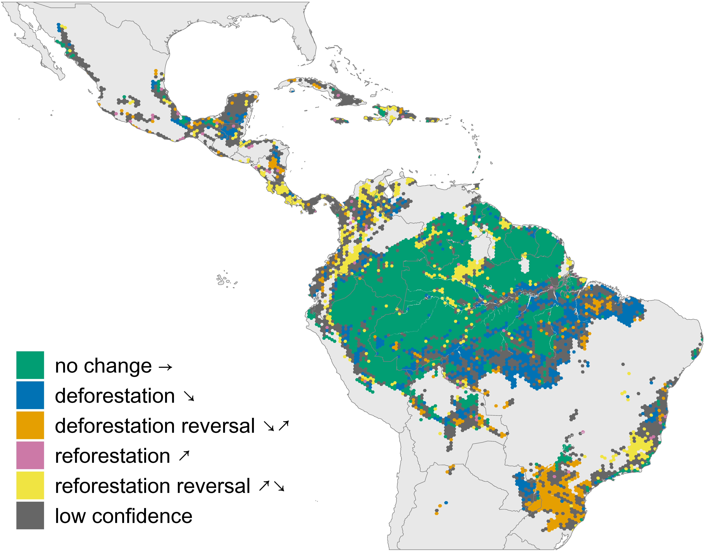
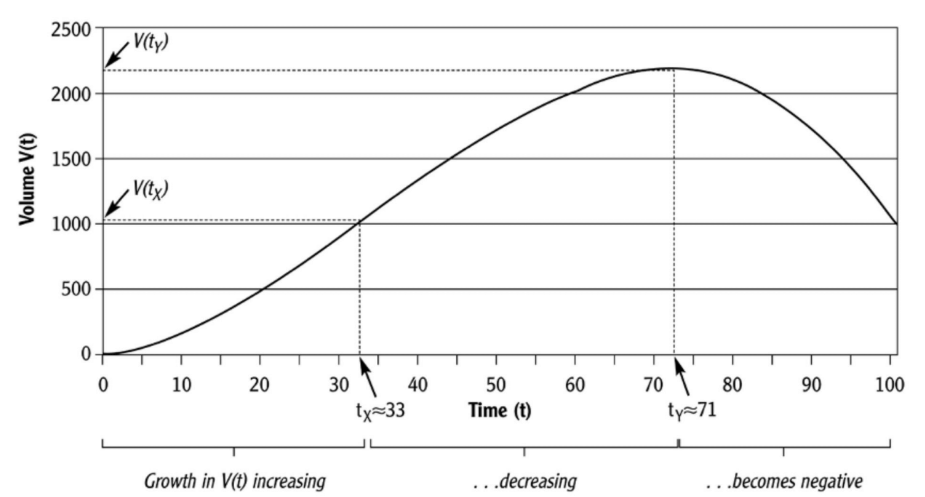
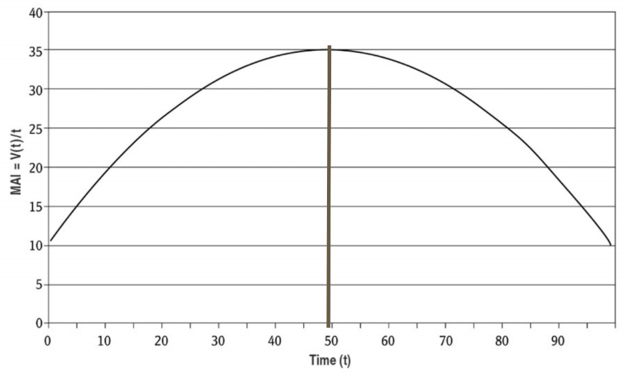
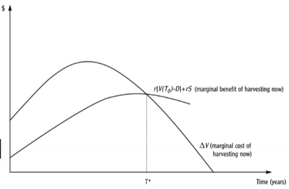
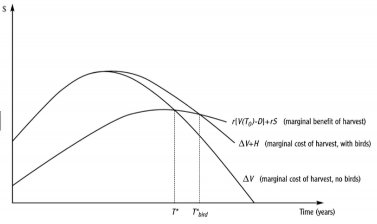
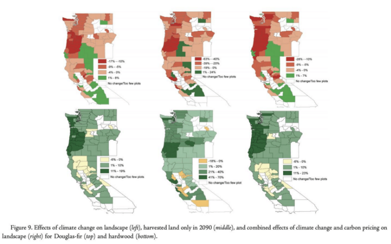

```{r Setup, include = F}
library(pacman)
p_load(ggthemes, readxl, viridis, knitr, dslabs, extrafont, Ecdat, tidyverse, magrittr, janitor, kableExtra)
# Define colors
red_pink <- "#e64173"
met_slate <- "#272822" # metropolis font color 
purple <- "#9370DB"
green <- "#007935"
light_green <- "#7DBA97"
orange <- "#FD5F00"
turquoise <- "#44C1C4"
red <- "#b92e34"
# Knitr options
opts_chunk$set(
  fig.align = "center",
  fig.height = 10,
  fig.width = 10.5,
  #dpi = 300,
  #cache = T,
  warning = F,
  message = F
)  
theme_simple <- theme_bw() + theme(
  axis.line = element_line(color = met_slate),
  panel.grid = element_blank(),
  rect = element_blank(),
  strip.text = element_blank(),
  text = element_text(family = "Fira Sans", color = met_slate, size = 17),
  axis.text.x = element_text(size = 16),
  axis.text.y = element_text(size = 16)
)
theme_market <- theme_bw() + theme(
  axis.line = element_line(color = met_slate),
  panel.grid = element_blank(),
  rect = element_blank(),
  strip.text = element_blank(),
  text = element_text(family = "Fira Sans", color = met_slate, size = 17),
  axis.title.x = element_text(hjust = 1, size = 17),
  axis.title.y = element_text(hjust = 1, angle = 0, size = 17),
  # axis.text.x = element_text(size = 12),
  # axis.text.y = element_text(size = 12),
  axis.ticks = element_blank()
)
theme_gif <- theme_bw() + theme(
  axis.line = element_line(color = met_slate),
  panel.grid = element_blank(),
  rect = element_blank(),
  text = element_text(family = "Fira Sans", color = met_slate, size = 17),
  axis.text.x = element_text(size = 12),
  axis.text.y = element_text(size = 12),
  axis.ticks = element_blank()
)
wrapper <- function(x, ...) paste(strwrap(x, ...), collapse = "\n")
# functions
demand <- function(x) 10 - x
demand_2 <- function(x) 9 - x
demand_3 <- function(x) 8 - x
demand_inc <- function(x) 11 - x
demand_dec <- function(x) 5 - x
supply <- function(x) 2 + 2*x
step_demand <- data.frame(x = c(0, 1, 2, 3, 4, 5, 6, 7, 8), mv = c(8, 7, 6, 5, 4, 3, 2, 1, 0))
```

# Tree Facts

There are over 60,000 species of trees in the world

<br>

Depending on the species, a tree can produce 260 pounds of oxygen in a year

<br>

20% of the world's oxygen is produced in the Amazon Rainforest

<br>

An acre of trees can remove 2.6 *tons* of CO2 in a year

<br> 

Trees help mitigate climate change by absorbing CO2 and also help with climate adaptation by locally cooling by up to 20 degrees

---

# Tree cover loss

.pull-left[


Many governments have realized the necessity of maintaining our forests

<br>

North American conservation efforts have lead to growing forests in aggregate since the 1940s

<br>

This isn't the case everywhere

]

.pull-right[


```{r, fig.retina = 1, echo = FALSE}

```
]

---

# Efficient?

One way (of many) to view trees is as capital for current and future generations

<br>

They are a finite resource that has the potential to regrow (like fish)

<br>

If we want people in the future to be able to benefit from trees, while still benefitting ourselves, we need to harvest in a way that doesn't affect their ability to grow back

<br>

We need to be **efficient** in our harvest relative to a function that takes future humans into account

---

# Harvest

.bigger[

It can be thought of as 'costly' to leave trees standing - the goal is to find *when* the relative benefit of harvesting them is at its highest

<br> 

The goal of an efficient harvest problem is to identify the **length of time to wait** between timber harvests that maximizes the difference between total benefits and total costs

<br>

Appropriately forward thinking models will consider the benefit to future society in this calculation

]

---

# Harvest time considerations

Dynamic models of human behavior and resource growth can get complicated fast

<br>

We can't capture all the nuances at once, so just keep in mind

  1. .green[**Forests have value outside of timber**]
  
    - Our simple model will only directly think of the benefit from commercial timber extraction
 <br>
 
  2. .pink[**Forest lands have a wide variety of property rights**]
  
    - We'll have to pick out one at a time to focus on
    
---

class: middle, inverse

.biggest[Model of Forest Growth]

---

# Biological rotation

.bigger[
Assume trees in a forest are homogenous (all exactly the same)

<br>

We can then measure the growth of the forest (or tree farm) as a function of time

<br>

Say that volume of trees follows $V(t) = 10t + t^2 - 0.01t^3$

]

---

# Biological rotation

$V(t) = 10t + t^2 - 0.01t^3$

```{r, fig.retina = 1, echo = FALSE}

```

---

# Calculus Time

To find the point where the maximum (or minimum) of a function occurs, we can take the *first derivative of the function*, set it equal to 0, and solve for $t$ in our case - We're finding where growth of the function = 0

<br>

$V(t) = 10t + t^2 - 0.01t^3$

--
<br>

$V'(t) = 10 + 2t - 0.03t^2$

$V'(t) = 10 + 2t - 0.03t^2 = 0$

--

$V'(t) = 0$ at $t \approx 71$

<br>

So the forest grows for 71 years before beginning to shrink

---

# Calculus Time

To find the point where growth *slows down* we need to take the *second derivative* set = 0, and solve for $t$ - We're  finding where the rate of change of growth is equal to 0

<br>

$V'(t) = 10 + 2t - 0.03t^2$

--

<br>
 
$V''(t) = 2 -0.06t$

$V''(t) = 2 -0.06t = 0$

--

$V''(t) = 0$ at $t \approx 33$

<br>

So the forest grows less than it did last year starting at year 33

---

# When to Harvest 

If growth slows at 33 years and growth stops at 71 years, when is the best time to harvest?

<br>

One .pink[harvest interval] is to let the forest grow for 71 years to maximize *volume* of harvest

<br>

A slightly more sophisticated option is to cut trees when .blue[**mean annual increment (MAI) is maximized]

<br>

$MAI = \frac{V(t)}{t}$, the average volume of the forest up to that year

<br>

Maximizing MAI as our harvest rule takes time into account and still maximizes some notion of tree volume

---

# Biological Rotation

.pull-left[

Harvesting according to maximizing MAI is called the .green[*biological rotation]

<br>

In our case $\frac{V(t)}{t} = 10 +t -0.01t^2$

<br>

MAI is maximized at 50 years

]

.pull-right[

```{r, fig.retina = 1, echo = FALSE}

```

]

---

# Biological Rotation

.bigger[
Biological rotation maximizes timber volume over years, but that's all it maximizes

<br>

It does not consider the benefits or costs to society of that volume

<br>

We need to consider more in our analysis
]

---

class: middle, inverse

.biggest[Wicksell Rotation]

---

# Wicksell Rotation

.bigger[

As a forest owner, one has to consider when the benefit of cutting outweigh the benefit of letting the tree continue to grow

<br>

The owner needs to compare the **net returns of cutting the trees this year to the net returns of waiting one more year**

]

---

# Wicksell Rotation

The .orange[Wicksell Rotation] focuses on when a *single harvest* most benefits a *private landowner*

<br>

With this simplification, it allows us to complicate the model in another way

<br>

It introduces the concept of time value of money into the optimal harvest decision

<br>

The owner considers the .red[**discount rate**]: the .underline[expected rate of return] for and investment, .green[**r**]

---

# Wicksell Rotation

The general rule for optimal harvesting in this context is to compare the net benefits of cutting this year to cutting next year

<br>

  - Don't Cut  if  $MNB_0 < MNB_1$
  
  - Cut        if  $MNB_0 = MNB_1$
  
  
<br>

If $MNB_0 > MNB_1$, you've technically missed your optimal harvest

---

# Wicksell Rotation

As a forest owner, what are the cost and benefit involved in the decision?

--

<br>


They can sell the timber at price $p$

It costs them $c$ to harvest each unit

They harvest every unit in the forest in that period - $V(T_0)$

--

<br>

$MNB_0 = (p-c)V(T_0)$

---

# Wicksell Rotation

How do we account for value in future periods?

--

We have to weight future value by the discount rate, $r$

<br>

--

$MNB_1 = \frac{(p-c)V(T_1)}{(1+r)}$

The larger $r$ is, the less we value future benefits

---

# Wicksell Rotation

Remember we want to find where $MNB_0 = MNB_1$

<br>

$MNB_0 = (p-c)V(T_0) =  \frac{(p-c)V(T_1)}{(1+r)} = MNB_1$

Assume price and cost stay fixed

--

$V(T_0) = \frac{(p-c)V(T_1)}{(1+r)}$

$V(T_0))(1+r) = V(T_1)$

$V(T_0) + V(T_0)r = V(T_1)$

--

<br>

$r = \frac{V(T_1)-V(T_0)}{V(T_0)}$ or $\frac{\Delta V}{V(T_0)}$

---

# Wicksell Rotation

$\frac{V(T_1)-V(T_0)}{V(T_0)}$ is the percent change in forest volume - Can also call this the *return to the capital asset* from not touching it for a year

<br>

Optimal harvest occurs when the percentage increase in the asset exactly equals the rate we discount future benefit at

<br>

We want growth to be just offset by how much we care about future value

<br>

A higher interest rate implies a shorter rotation - harvesting when the forest is still growing at a higher rate

---

# Wicksell Rotation

.pull-left[

```{r, fig.retina = 1, echo = FALSE}

```

]

.pull-right[

The longer growth rate is increasing, the longer we wait to harvest

<br>

In this example, as long as $ r> 0.02$, the Wicksell rotation is shorter than the *biological rotation*

<br>

It would not be optimal to the owner to maximize volume
]

---

class: middle, inverse

.biggest[Faustmann Rotation]

---

# Faustmann Rotation

.pink[Biological Rotation] tells us to maximize average tree volume


<br>

.orange[Wicksell Rotation] takes into account the time value of money

<br>

The .blue[Faustmann Rotation] adds two more real world items to think of

  1. The **Site Value**, $S$ of the forested piece of land
  
  2. The **Cost of Replanting**, $D$, after a harvest
  
---

# Faustmann Rotation

The Faustmann Rotation not only when to harvest, but also **alternative land use**

<br>

Each year, the land owner has multiple choices:

  1. Cut and replant
  
  2. Wait, then cut and replant
  
  3. Cut and change land use
  
  4. Wait, cut and change land use
  
---

# Site Value

Site value is equal to the value of the land used in its most profitable way - what you could sell it for or make off the land if it weren't forest

<br> 

If forestry is the most profitable land use, $S$ is the value of land as timber harvest, but if it would be more valuable as different kind of farm or land for housing, $S$ will reflect one of those

<br>

The site value is equal to the *present value of expected future revenue* from the land in its most profitable use

<br>

Think of the discount rate - $110 next year is worth only $100 to you now

<br>

Adding $S$ to the model allows us to think of the *opportunity cost* of using the land for forestry

---

# Faustmann Optimal Harvest

Our rule is similar to Wicksell Rotation - with just a few complications

<br>

Cut and replant when $MNB_{cut,0} = MNB_{cut,1}$

<br>

But these benefits now must take into account $D$ - the cost of starting over - and $S$ - what we could sell the land for this period

--

$MNB_{cut,0} = (p-c)V(T_0)-D+S$

$MNB_{cut,1} = \frac{(p-c)[V(T_0)+ \Delta V]-D+S}{1+r}$

---

# Faustmann Optimal Harvest

We know $(p-c)$ is going to wash out, so lets simplify the equation

<br>

--

$V(T_0)-D+S = \frac{(V(T_0)+ \Delta V)-D+S}{1+r}$


--

$(V(T_0)-D+S)(1+r) = (V(T_0)+ \Delta V)-D+S$

$V(T_0) + rV(T_0) - D + S -rD +rS =(V(T_0)+ \Delta V)-D+S$

--

<br>

$r(V(T_0) - D) + rS = \Delta V$

--

The LHS is the benefit of harvesting NOW. The RHS is the cost(forgone value of timber) from harvesting now

---

# Faustmann Optimal Harvest

.pull-left[

```{r, fig.retina = 1, echo = FALSE}

```


]


.pull-right[

We can graph the cost and benefit - where the curves cross is the $T*$ when we should harvest

<br>

Intitially tree growth out paces the marginal benefit of harvest

<br>

But as growth slows down, eventually the benefit of harvesting catches up

]

---

# Faustmann Optimal Harvest

We can look at this condition the same we did Wicksell, by putting $r$ by itself

$r = \frac{\Delta V}{V(T_0) - D + S}$

<br>

The land owner should time harvest so that her rate of return on the asset is equal to her discount rate

<br>

The only difference between this and Wicksell is that the value of the land and cost of upkeep is also being taken into account

---

# Faustmann Optimal Harvest

Compared to the biological and Wicksell Rotations, Faustmann is mechanically shorter than both:

$T_B > T_W > T_F$

<br>

Given reasonable assumptions on the discount rate, Wicksell is shorter than the biological

<br>

Faustmann forces the rotation to be shorter by including $D$ and $S$

$\frac{\Delta V}{V(T_0) - D + S} > \frac{\Delta V}{V(T_0)}$

Assuming $S - D$ is positive (would it make sense for this not to be the case?)

--

Since this means a higher $r$ under Faustmann, we get a shorter rotation(harvesting when growth rate is higher)

---

class: middle, inverse

.biggest[Non-timber Benefits]

---

# Non-timber benefits

Of course forests have values outside of timber harvesting

Forests bring value through:

  - Acting as recreational areas
  
  - Providing Oxygen
  
  - Acting as natural filtration for water 
  
  - Promoting biodiversity
  
  - Having incalculable intrinsic value
  
---

# Non-timber benefits

.bigger[
To go along with these benefits, there are costs beyond the profit margin when it comes to harvesting trees

<br>

Old Growth forests are forests that have stood long enough to promote ecosystems within themselves

<br>

By removing these, we are removing habitats for animals and other organisms - potentially driving them to extinction

]

---

# Non-timber benefits and Optimal harvest

.pull-left[

```{r, fig.retina = 1, echo = FALSE}

```

]

.pull-right[

Consider adding $H$, the losses involved with harvesting, to our Faustmann problem

<br>

This moves the curve upwards ,meaning intersection will occur at a later $T*$

<br>

Depending on the value of $H$, it's possible that the value is so high that T* may be infinite(it's never optimal to cut down the trees)

]

---

# Property Rights

Forests may be public goods (National Parks) or open-access resources(timber harvests)

<br>

The open-access equilibrium may lead to over-harvesting and deforestation

<br>

By introducing property rights, we may be able to alleviate the over-harvesting issue
  - Remember that the owner still has their own interests in mind, though
  
<br>

Property rights can be especially helpful because efficient rotation cycles can be VERY long (upwards of 80 years)

<br>

Owners are less likely to cut down trees inefficiently early if they don't have to worry about others beating them to it

---

# Complications

Forest management is not as simple as we have presented thus far

<br> 

Harvesters also have to contend with

  - Wildfires, which are partially exasperated by improper forest management
  
    - Pollution
  
  - Changing climates
  
  - Societal benefits
  
---

# Complications

.pull-left[

```{r, fig.retina = 1, echo = FALSE}

```

]

.pull-right[

Hashida and Lewis(2019) predict a shift in forest compositions on the west coast from Douglas Firs to Ponderosa Pines or hardwoods

<br>

Given the changing climate, Douglas Firs do not perform as well as less native alternatives


]

---

# Complications

Forest managers may also face new incentives to *not* cut down trees

<br>

Governments are increasingly adopting carbon pricing policies that can be complemented by increased forest presence

<br>

Policies in the future may pay forest managers to now cut down some of their trees - changing the problem they solve to determine optimal rotation length