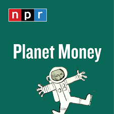
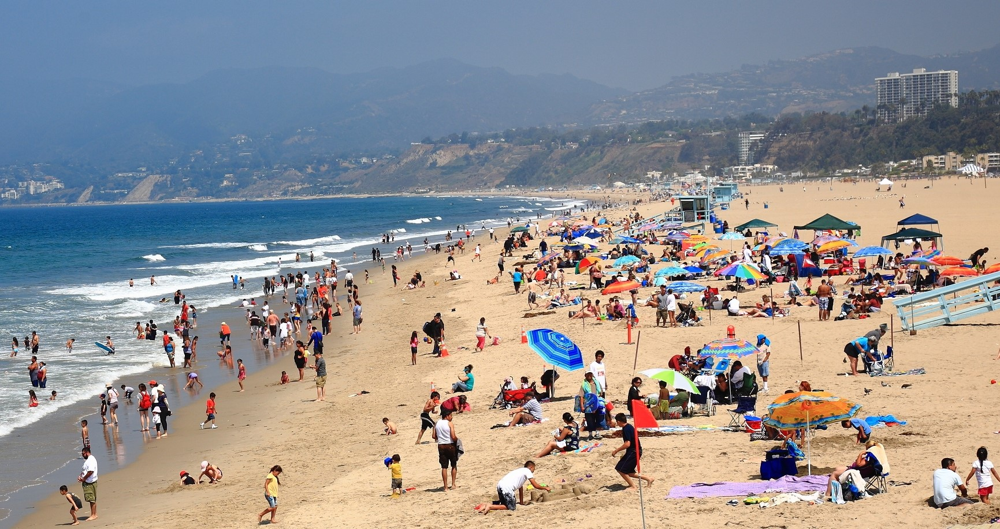
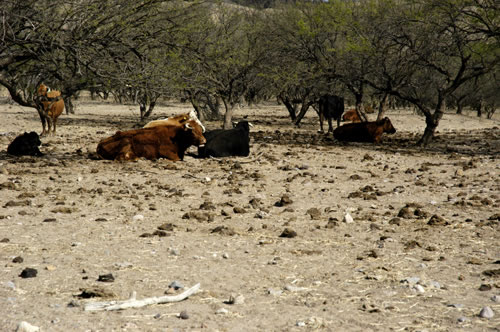
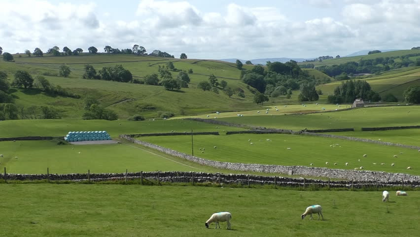

```{r Setup, include = F}
library(pacman)
p_load(ggthemes, readxl, viridis, knitr, dslabs, extrafont, Ecdat, tidyverse, magrittr, janitor, kableExtra)
# Define colors
red_pink <- "#e64173"
met_slate <- "#272822" # metropolis font color 
purple <- "#9370DB"
green <- "#007935"
light_green <- "#7DBA97"
orange <- "#FD5F00"
turquoise <- "#44C1C4"
red <- "#b92e34"
# Knitr options
opts_chunk$set(
  fig.align = "center",
  fig.height = 10,
  fig.width = 10.5,
  #dpi = 300,
  #cache = T,
  warning = F,
  message = F
)  
theme_simple <- theme_bw() + theme(
  axis.line = element_line(color = met_slate),
  panel.grid = element_blank(),
  rect = element_blank(),
  strip.text = element_blank(),
  text = element_text(family = "Fira Sans", color = met_slate, size = 17),
  axis.text.x = element_text(size = 16),
  axis.text.y = element_text(size = 16)
)
theme_market <- theme_bw() + theme(
  axis.line = element_line(color = met_slate),
  panel.grid = element_blank(),
  rect = element_blank(),
  strip.text = element_blank(),
  text = element_text(family = "Fira Sans", color = met_slate, size = 17),
  axis.title.x = element_text(hjust = 1, size = 17),
  axis.title.y = element_text(hjust = 1, angle = 0, size = 17),
  # axis.text.x = element_text(size = 12),
  # axis.text.y = element_text(size = 12),
  axis.ticks = element_blank()
)
theme_gif <- theme_bw() + theme(
  axis.line = element_line(color = met_slate),
  panel.grid = element_blank(),
  rect = element_blank(),
  text = element_text(family = "Fira Sans", color = met_slate, size = 17),
  axis.text.x = element_text(size = 12),
  axis.text.y = element_text(size = 12),
  axis.ticks = element_blank()
)
wrapper <- function(x, ...) paste(strwrap(x, ...), collapse = "\n")
# functions
demand <- function(x) 10 - x
demand_2 <- function(x) 9 - x
demand_3 <- function(x) 8 - x
demand_inc <- function(x) 11 - x
demand_dec <- function(x) 5 - x
supply <- function(x) 2 + 2*x
step_demand <- data.frame(x = c(0, 1, 2, 3, 4, 5, 6, 7, 8), mv = c(8, 7, 6, 5, 4, 3, 2, 1, 0))

theme_game <- theme_bw() + theme(
  axis.line = element_line(),
  panel.grid = element_blank(),
  rect = element_rect(size = 1),
  strip.text = element_blank(),
  text = element_text(size = 17, family = "Fira Sans"), 
  axis.text.x = element_text(size = 17, color = purple),
  axis.text.y = element_text(size = 17, angle = 90, color = red_pink, hjust = 0.5),
  axis.title.x = element_text(color = purple, size = 19),
  axis.title.y = element_text(color = red_pink, size = 19),
  axis.ticks = element_blank(),
  plot.title = element_blank(),
  legend.position = "none"
)
theme_goods <- theme_bw() + theme(
  axis.line = element_line(),
  panel.grid = element_blank(),
  rect = element_rect(size = 1),
  strip.text = element_blank(),
  text = element_text(size = 17, family = "Fira Sans"), 
  axis.text.x = element_text(size = 17),
  axis.text.y = element_text(size = 17, angle = 90, hjust = 0.5),
  axis.title.x = element_text(color = purple, size = 19),
  axis.title.y = element_text(color = red_pink, size = 19),
  axis.ticks = element_blank(),
  plot.title = element_blank(),
  legend.position = "none"
)
game_box_1 <- function(x) 5 - x
game_box_2 <- function(x) 10 - x
game_box_3 <- function(x) 15 - x
w <- seq(0, 5, 0.01)
z <- seq(5, 10, 0.01)
wrapper <- function(x, ...) paste(strwrap(x, ...), collapse = "\n")
```


# Private *vs.* Public Goods

**Q.sub[1]:** Who pays?

**Q.sub[2]:** Who benefits?

.pull-left[
.center[**Private Good:** Groceries]
```{r, fig.retina = 2.75, echo = FALSE}

```
]

.pull-left[
.center[**Public Good:** Park]
```{r, fig.retina = 2, echo = FALSE}

```
]

---
# Excludability

## Definition

> The extent to which a consumer of a good can restrict others from using it. 

**Excludable:** Access to the benefits of a good is restricted to those who pay for the good.

- *e.g.,* groceries, apartments, vehicles, *etc.*

**Non-Excludable:** Anyone can access the benefits of a good, whether she paid for it or not.

- *e.g.,* parks, national defense, sunshine, *etc.*

---
# Excludable or Non-Excludable?

.pull-left[
.center[**Podcast**]
```{r, fig.retina = 1, echo = FALSE}

```
]

.pull-right[
.center[**Phone**]
```{r, fig.retina = 1, echo = FALSE}

```
]

---
count: false
# Excludable or Non-Excludable?

.pull-left[
.center[**Podcast**]
```{r, fig.retina = 1, echo = FALSE}

```

.center[**A:** .pink[Non-excludable.]]
]

.pull-right[
.center[**Phone**]
```{r, fig.retina = 1, echo = FALSE}

```

<br>

.center[**A:** .pink[Excludable.]]
]

---
# Excludable or Non-Excludable?

.pull-left[
.center[**Clean Air**]
```{r, fig.retina = 1.2, echo = FALSE}

```
]

.pull-right[
.center[**Beach**]
```{r, fig.retina = 3, echo = FALSE}

```
]

---
count: false
# Excludable or Non-Excludable?

.pull-left[
.center[**Clean Air**]
```{r, fig.retina = 1.2, echo = FALSE}

```

.center[**A:** .pink[Non-excludable.]]
]

.pull-right[
.center[**Beach**]
```{r, fig.retina = 3, echo = FALSE}

```

.center[**A:** .pink[Depends. <br> Private .mono[-->] excludable. <br> Public .mono[-->] non-excludable.]]
]

---
# Rivalry

## Definition

> Extent to which the consumption of a good by one person reduces the ability of others to consume it.

**Rival:** Consumption by one person 1) prevents others from consuming or 2) diminishes the value of the good for others.

- *e.g.,* your lunch, your toothbrush, your laptop, *etc.*

**Non-Rival:** People can consume the good simultaneously without diminishing its value.

- *e.g.,* lighthouses, scenic views, knowledge, *etc.*

---
# Rival or Non-Rival?

.pull-left[
.center[**Podcast**]
```{r, fig.retina = 1, echo = FALSE}

```
]

.pull-right[
.center[**Phone**]
```{r, fig.retina = 1, echo = FALSE}

```
]

---
count: false
# Rival or Non-Rival?

.pull-left[
.center[**Podcast**]
```{r, fig.retina = 1, echo = FALSE}

```

.center[**A:** .pink[Non-rival.]]
]

.pull-right[
.center[**Phone**]
```{r, fig.retina = 1, echo = FALSE}

```

<br>

.center[**A:** .pink[Rival.]]
]

---
# Rival or Non-Rival?

.pull-left[
.center[**Clean Air**]
```{r, fig.retina = 1.2, echo = FALSE}

```
]

.pull-right[
.center[**Beach**]
```{r, fig.retina = 3, echo = FALSE}

```
]

---
count: false
# Rival or Non-Rival?

.pull-left[
.center[**Clean Air**]
```{r, fig.retina = 1.2, echo = FALSE}

```

.center[**A:** .pink[Non-rival.]]
]

.pull-right[
.center[**Beach**]
```{r, fig.retina = 3, echo = FALSE}

```

.center[**A:** .pink[Rival.]]
]

---
# Types of Goods

```{r, echo = FALSE, fig.height = 5.5, fig.width = 5.5, dev = "svg"}
strategies_p1 <- c("Non-Excludable", "Excludable")
strategies_p2 <- c("Rival", "Non-Rival")

ggplot() + 
  scale_x_continuous(limits = c(0, 10), expand = c(0,0), breaks = c(2.5, 7.5), labels = strategies_p2, position = "top")+
  scale_y_continuous(limits = c(0, 10), expand = c(0,0), breaks = c(2.5, 7.5), labels = strategies_p1) +
  labs(x = "", y = "") +
  # Player 1 payoffs
  annotate("text", label = expression("Private Good"), x = 2.5, y = 7.5, family = "Fira Sans", size = 6, color = purple) +
  annotate("text", label = expression("Club Good"), x = 7.5, y = 7.5, family = "Fira Sans", size = 6, color = purple) +
  annotate("text", label = wrapper(expression("Open Access"), 10), x = 2.5, y = 2.5, family = "Fira Sans", size = 6, color = red_pink) +
  annotate("text", label = expression("Public Good"), x = 7.7, y = 2.5, family = "Fira Sans", size = 6, color = red_pink) +
  # theme stuff
  theme_goods +
  geom_segment(aes(x = 5, y = 0, xend = 5, yend = 10), linetype  = "solid", size = 1) +
  geom_segment(aes(x = 0, y = 5, xend = 10, yend = 5), linetype  = "solid", size = 1) +
  geom_ribbon(aes(x = w, ymin = 0, ymax = 5), fill = red_pink, alpha = 0.2, linetype = "blank") +
  geom_ribbon(aes(x = z, ymin = 0, ymax = 5), fill = red_pink, alpha = 0.2, linetype = "blank") +
  geom_ribbon(aes(x = w, ymin = 5, ymax = 10), fill = purple, alpha = 0.2, linetype = "blank") +
  geom_ribbon(aes(x = z, ymin = 5, ymax = 10), fill = purple, alpha = 0.2, linetype = "blank")
```

---
# Private Goods

.pull-left[
```{r, echo = FALSE, fig.height = 4.5, fig.width = 4.5, dev = "svg"}
strategies_p1 <- c("Non-Excludable", "Excludable")
strategies_p2 <- c("Rival", "Non-Rival")

ggplot() + 
  scale_x_continuous(limits = c(0, 10), expand = c(0,0), breaks = c(2.5, 7.5), labels = strategies_p2, position = "top")+
  scale_y_continuous(limits = c(0, 10), expand = c(0,0), breaks = c(2.5, 7.5), labels = strategies_p1) +
  labs(x = "", y = "") +
  # Player 1 payoffs
  annotate("label", label = expression("Private Good"), x = 2.5, y = 7.5, family = "Fira Sans", size = 6, color = purple) +
  annotate("text", label = expression("Club Good"), x = 7.5, y = 7.5, family = "Fira Sans", size = 6, color = purple) +
  annotate("text", label = wrapper(expression("Open Access"), 10), x = 2.5, y = 2.5, family = "Fira Sans", size = 6, color = red_pink) +
  annotate("text", label = expression("Public Good"), x = 7.7, y = 2.5, family = "Fira Sans", size = 6, color = red_pink) +
  # theme stuff
  theme_goods +
  geom_segment(aes(x = 5, y = 0, xend = 5, yend = 10), linetype  = "solid", size = 1) +
  geom_segment(aes(x = 0, y = 5, xend = 10, yend = 5), linetype  = "solid", size = 1) +
  geom_ribbon(aes(x = w, ymin = 0, ymax = 5), fill = red_pink, alpha = 0.2, linetype = "blank") +
  geom_ribbon(aes(x = z, ymin = 0, ymax = 5), fill = red_pink, alpha = 0.2, linetype = "blank") +
  geom_ribbon(aes(x = w, ymin = 5, ymax = 10), fill = purple, alpha = 0.2, linetype = "blank") +
  geom_ribbon(aes(x = z, ymin = 5, ymax = 10), fill = purple, alpha = 0.2, linetype = "blank")
```
]

.pull-right[

Property rights well-defined .mono[<=>] Consumer pays all costs and experiences all benefits at the margin.


Most consumer products are private goods.


- *e.g.,* jeans, watches, shoes, groceries, automobiles, notebooks, headphones, vitamins, toothbrushes, houses, *etc.*

]

---
# Private Goods

.pull-left[
```{r, echo = FALSE, fig.height = 4.5, fig.width = 4.5, dev = "svg"}
strategies_p1 <- c("Non-Excludable", "Excludable")
strategies_p2 <- c("Rival", "Non-Rival")

ggplot() + 
  scale_x_continuous(limits = c(0, 10), expand = c(0,0), breaks = c(2.5, 7.5), labels = strategies_p2, position = "top")+
  scale_y_continuous(limits = c(0, 10), expand = c(0,0), breaks = c(2.5, 7.5), labels = strategies_p1) +
  labs(x = "", y = "") +
  # Player 1 payoffs
  annotate("label", label = expression("Private Good"), x = 2.5, y = 7.5, family = "Fira Sans", size = 6, color = purple) +
  annotate("text", label = expression("Club Good"), x = 7.5, y = 7.5, family = "Fira Sans", size = 6, color = purple) +
  annotate("text", label = wrapper(expression("Open Access"), 10), x = 2.5, y = 2.5, family = "Fira Sans", size = 6, color = red_pink) +
  annotate("text", label = expression("Public Good"), x = 7.7, y = 2.5, family = "Fira Sans", size = 6, color = red_pink) +
  # theme stuff
  theme_goods +
  geom_segment(aes(x = 5, y = 0, xend = 5, yend = 10), linetype  = "solid", size = 1) +
  geom_segment(aes(x = 0, y = 5, xend = 10, yend = 5), linetype  = "solid", size = 1) +
  geom_ribbon(aes(x = w, ymin = 0, ymax = 5), fill = red_pink, alpha = 0.2, linetype = "blank") +
  geom_ribbon(aes(x = z, ymin = 0, ymax = 5), fill = red_pink, alpha = 0.2, linetype = "blank") +
  geom_ribbon(aes(x = w, ymin = 5, ymax = 10), fill = purple, alpha = 0.2, linetype = "blank") +
  geom_ribbon(aes(x = z, ymin = 5, ymax = 10), fill = purple, alpha = 0.2, linetype = "blank")
```
]

.pull-right[

Usually provided by firms in a market setting.

Private Marginal Benefit(PMB) = Private Marginal Cost(PMC) $\iff$

Social Marginal Benefit (SMB) = Social Marginal Cost(SMC)

- Perfectly competitive markets without externalities allocate private goods efficiently.

**Q:** Can you think of an example where the government provides private goods?

]

---
# Club Goods

.pull-left[
```{r, echo = FALSE, fig.height = 4.5, fig.width = 4.5, dev = "svg"}
strategies_p1 <- c("Non-Excludable", "Excludable")
strategies_p2 <- c("Rival", "Non-Rival")

ggplot() + 
  scale_x_continuous(limits = c(0, 10), expand = c(0,0), breaks = c(2.5, 7.5), labels = strategies_p2, position = "top")+
  scale_y_continuous(limits = c(0, 10), expand = c(0,0), breaks = c(2.5, 7.5), labels = strategies_p1) +
  labs(x = "", y = "") +
  # Player 1 payoffs
  annotate("text", label = expression("Private Good"), x = 2.5, y = 7.5, family = "Fira Sans", size = 6, color = purple) +
  annotate("label", label = expression("Club Good"), x = 7.5, y = 7.5, family = "Fira Sans", size = 6, color = purple) +
  annotate("text", label = wrapper(expression("Open Access"), 10), x = 2.5, y = 2.5, family = "Fira Sans", size = 6, color = red_pink) +
  annotate("text", label = expression("Public Good"), x = 7.7, y = 2.5, family = "Fira Sans", size = 6, color = red_pink) +
  # theme stuff
  theme_goods +
  geom_segment(aes(x = 5, y = 0, xend = 5, yend = 10), linetype  = "solid", size = 1) +
  geom_segment(aes(x = 0, y = 5, xend = 10, yend = 5), linetype  = "solid", size = 1) +
  geom_ribbon(aes(x = w, ymin = 0, ymax = 5), fill = red_pink, alpha = 0.2, linetype = "blank") +
  geom_ribbon(aes(x = z, ymin = 0, ymax = 5), fill = red_pink, alpha = 0.2, linetype = "blank") +
  geom_ribbon(aes(x = w, ymin = 5, ymax = 10), fill = purple, alpha = 0.2, linetype = "blank") +
  geom_ribbon(aes(x = z, ymin = 5, ymax = 10), fill = purple, alpha = 0.2, linetype = "blank")
```
]

.pull-right[

Property rights not well-defined .mono[<=>] Consumer pays to "join the club," but does not necessarily pay for the marginal costs of using the good thereafter.


Many subscription or membership-based services are club goods.

- *e.g.,* Cable, satellite TV, Netflix, Spotify Premium, country clubs, gyms, *etc.*
]

---
# Club Goods

.pull-left[
```{r, echo = FALSE, fig.height = 4.5, fig.width = 4.5, dev = "svg"}
strategies_p1 <- c("Non-Excludable", "Excludable")
strategies_p2 <- c("Rival", "Non-Rival")

ggplot() + 
  scale_x_continuous(limits = c(0, 10), expand = c(0,0), breaks = c(2.5, 7.5), labels = strategies_p2, position = "top")+
  scale_y_continuous(limits = c(0, 10), expand = c(0,0), breaks = c(2.5, 7.5), labels = strategies_p1) +
  labs(x = "", y = "") +
  # Player 1 payoffs
  annotate("text", label = expression("Private Good"), x = 2.5, y = 7.5, family = "Fira Sans", size = 6, color = purple) +
  annotate("label", label = expression("Club Good"), x = 7.5, y = 7.5, family = "Fira Sans", size = 6, color = purple) +
  annotate("text", label = wrapper(expression("Open Access"), 10), x = 2.5, y = 2.5, family = "Fira Sans", size = 6, color = red_pink) +
  annotate("text", label = expression("Public Good"), x = 7.7, y = 2.5, family = "Fira Sans", size = 6, color = red_pink) +
  # theme stuff
  theme_goods +
  geom_segment(aes(x = 5, y = 0, xend = 5, yend = 10), linetype  = "solid", size = 1) +
  geom_segment(aes(x = 0, y = 5, xend = 10, yend = 5), linetype  = "solid", size = 1) +
  geom_ribbon(aes(x = w, ymin = 0, ymax = 5), fill = red_pink, alpha = 0.2, linetype = "blank") +
  geom_ribbon(aes(x = z, ymin = 0, ymax = 5), fill = red_pink, alpha = 0.2, linetype = "blank") +
  geom_ribbon(aes(x = w, ymin = 5, ymax = 10), fill = purple, alpha = 0.2, linetype = "blank") +
  geom_ribbon(aes(x = z, ymin = 5, ymax = 10), fill = purple, alpha = 0.2, linetype = "blank")
```
]

.pull-right[

Often provided by firms rather than governments.

Providers of club goods usually have market power (*e.g.,* Comcast).

- Fixed cost of network is high, but marginal cost of new subscription is low.

- Firms set price where MV .mono[>] MC (don't have to follow perfect competition rules) <br> .mono[-->] artificial scarcity <br>  .mono[-->] inefficient!

]

---
# Open Access Goods

.pull-left[
```{r, echo = FALSE, fig.height = 4.5, fig.width = 4.5, dev = "svg"}
strategies_p1 <- c("Non-Excludable", "Excludable")
strategies_p2 <- c("Rival", "Non-Rival")

ggplot() + 
  scale_x_continuous(limits = c(0, 10), expand = c(0,0), breaks = c(2.5, 7.5), labels = strategies_p2, position = "top")+
  scale_y_continuous(limits = c(0, 10), expand = c(0,0), breaks = c(2.5, 7.5), labels = strategies_p1) +
  labs(x = "", y = "") +
  # Player 1 payoffs
  annotate("text", label = expression("Private Good"), x = 2.5, y = 7.5, family = "Fira Sans", size = 6, color = purple) +
  annotate("text", label = expression("Club Good"), x = 7.5, y = 7.5, family = "Fira Sans", size = 6, color = purple) +
  annotate("label", label = wrapper(expression("Open Access"), 10), x = 2.5, y = 2.5, family = "Fira Sans", size = 6, color = red_pink) +
  annotate("text", label = expression("Public Good"), x = 7.7, y = 2.5, family = "Fira Sans", size = 6, color = red_pink) +
  # theme stuff
  theme_goods +
  geom_segment(aes(x = 5, y = 0, xend = 5, yend = 10), linetype  = "solid", size = 1) +
  geom_segment(aes(x = 0, y = 5, xend = 10, yend = 5), linetype  = "solid", size = 1) +
  geom_ribbon(aes(x = w, ymin = 0, ymax = 5), fill = red_pink, alpha = 0.2, linetype = "blank") +
  geom_ribbon(aes(x = z, ymin = 0, ymax = 5), fill = red_pink, alpha = 0.2, linetype = "blank") +
  geom_ribbon(aes(x = w, ymin = 5, ymax = 10), fill = purple, alpha = 0.2, linetype = "blank") +
  geom_ribbon(aes(x = z, ymin = 5, ymax = 10), fill = purple, alpha = 0.2, linetype = "blank")
```
]

.pull-right[

Property rights not well-defined .mono[<=>] Consumer experiences all marginal benefits, but does not pay all marginal costs.

Since PMC < SMC, Open Access goods are prone to overextraction.

- *e.g.,* fish, deer or elk on public land, hors d'oeuvres at a party, booze at an open bar, *etc.*

]

---
# Open Access Goods

.pull-left[
```{r, echo = FALSE, fig.height = 4.5, fig.width = 4.5, dev = "svg"}
strategies_p1 <- c("Non-Excludable", "Excludable")
strategies_p2 <- c("Rival", "Non-Rival")

ggplot() + 
  scale_x_continuous(limits = c(0, 10), expand = c(0,0), breaks = c(2.5, 7.5), labels = strategies_p2, position = "top")+
  scale_y_continuous(limits = c(0, 10), expand = c(0,0), breaks = c(2.5, 7.5), labels = strategies_p1) +
  labs(x = "", y = "") +
  # Player 1 payoffs
  annotate("text", label = expression("Private Good"), x = 2.5, y = 7.5, family = "Fira Sans", size = 6, color = purple) +
  annotate("text", label = expression("Club Good"), x = 7.5, y = 7.5, family = "Fira Sans", size = 6, color = purple) +
  annotate("label", label = wrapper(expression("Open Access"), 10), x = 2.5, y = 2.5, family = "Fira Sans", size = 6, color = red_pink) +
  annotate("text", label = expression("Public Good"), x = 7.7, y = 2.5, family = "Fira Sans", size = 6, color = red_pink) +
  # theme stuff
  theme_goods +
  geom_segment(aes(x = 5, y = 0, xend = 5, yend = 10), linetype  = "solid", size = 1) +
  geom_segment(aes(x = 0, y = 5, xend = 10, yend = 5), linetype  = "solid", size = 1) +
  geom_ribbon(aes(x = w, ymin = 0, ymax = 5), fill = red_pink, alpha = 0.2, linetype = "blank") +
  geom_ribbon(aes(x = z, ymin = 0, ymax = 5), fill = red_pink, alpha = 0.2, linetype = "blank") +
  geom_ribbon(aes(x = w, ymin = 5, ymax = 10), fill = purple, alpha = 0.2, linetype = "blank") +
  geom_ribbon(aes(x = z, ymin = 5, ymax = 10), fill = purple, alpha = 0.2, linetype = "blank")
```
]

.pull-right[

Property rights not well-defined .mono[<=>] Consumer experiences all marginal benefits, but does not pay all marginal costs.

Other Open Accesss are prone to congestion or pollution.

- *e.g.,* roads, clean water, national parks, your dorm room, *etc.*


]

---
# Open Access Goods

.pull-left[
```{r, echo = FALSE, fig.height = 4.5, fig.width = 4.5, dev = "svg"}
strategies_p1 <- c("Non-Excludable", "Excludable")
strategies_p2 <- c("Rival", "Non-Rival")

ggplot() + 
  scale_x_continuous(limits = c(0, 10), expand = c(0,0), breaks = c(2.5, 7.5), labels = strategies_p2, position = "top")+
  scale_y_continuous(limits = c(0, 10), expand = c(0,0), breaks = c(2.5, 7.5), labels = strategies_p1) +
  labs(x = "", y = "") +
  # Player 1 payoffs
  annotate("text", label = expression("Private Good"), x = 2.5, y = 7.5, family = "Fira Sans", size = 6, color = purple) +
  annotate("text", label = expression("Club Good"), x = 7.5, y = 7.5, family = "Fira Sans", size = 6, color = purple) +
  annotate("label", label = wrapper(expression("Open Access"), 10), x = 2.5, y = 2.5, family = "Fira Sans", size = 6, color = red_pink) +
  annotate("text", label = expression("Public Good"), x = 7.7, y = 2.5, family = "Fira Sans", size = 6, color = red_pink) +
  # theme stuff
  theme_goods +
  geom_segment(aes(x = 5, y = 0, xend = 5, yend = 10), linetype  = "solid", size = 1) +
  geom_segment(aes(x = 0, y = 5, xend = 10, yend = 5), linetype  = "solid", size = 1) +
  geom_ribbon(aes(x = w, ymin = 0, ymax = 5), fill = red_pink, alpha = 0.2, linetype = "blank") +
  geom_ribbon(aes(x = z, ymin = 0, ymax = 5), fill = red_pink, alpha = 0.2, linetype = "blank") +
  geom_ribbon(aes(x = w, ymin = 5, ymax = 10), fill = purple, alpha = 0.2, linetype = "blank") +
  geom_ribbon(aes(x = z, ymin = 5, ymax = 10), fill = purple, alpha = 0.2, linetype = "blank")
```
]

.pull-right[

Unregulated markets often fail to manage open access goods efficiently. 

- Rivalry creates a sense of urgency among users to extract the resource before others.

- Non-excludability makes maintenance of the resource unattractive to users.

- **Result:** Overuse and neglect, especially of environmental goods

- Also known as **.green[The Tragedy of the Commons]**
]


---
# Tragedy of the Commons

## Example: Common Pasture

.pull-left[
```{r, echo = FALSE, fig.height = 4.5, fig.width = 4.5, dev = "svg"}
strategies_p1 <- c("Overgraze", "Graze Sustainably")
strategies_p2 <- c("Graze Sustainably", "Overgraze")

ggplot() + 
  scale_x_continuous(limits = c(0, 10), expand = c(0,0), breaks = c(2.5, 7.5), labels = strategies_p2, position = "top")+
  scale_y_continuous(limits = c(0, 10), expand = c(0,0), breaks = c(2.5, 7.5), labels = strategies_p1) +
  labs(x = "Herder 2", y = "Herder 1") +
  # Player 1 payoffs
  annotate("text", label = expression(100), x = 1.75, y = 6, family = "Fira Sans", size = 6, color = red_pink) +
  annotate("text", label = expression(20), x = 6.75, y = 6, family = "Fira Sans", size = 6, color = red_pink) +
  annotate("text", label = expression(120), x = 1.75, y = 1, family = "Fira Sans", size = 6, color = red_pink) +
  annotate("text", label = expression(30), x = 6.75, y = 1, family = "Fira Sans", size = 6, color = red_pink) +
  # Player 2 payoffs
  annotate("text", label = expression(100), x = 3.25, y = 9, family = "Fira Sans", size = 6, color = purple) +
  annotate("text", label = expression(120), x = 8.25, y = 9, family = "Fira Sans", size = 6, color = purple) +
  annotate("text", label = expression(20), x = 3.25, y = 4, family = "Fira Sans", size = 6, color = purple) +
  annotate("text", label = expression(30), x = 8.25, y = 4, family = "Fira Sans", size = 6, color = purple) +
  # theme stuff
  theme_game +
  geom_segment(aes(x = 0, y = 10, xend = 10, yend = 0), linetype  = "dashed", size = 0.5) +
  geom_segment(aes(x = 5, y = 10, xend = 10, yend = 5), linetype  = "dashed", size = 0.5) +
  geom_segment(aes(x = 0, y = 5, xend = 5, yend = 0), linetype  = "dashed", size = 0.5) +
  geom_segment(aes(x = 5, y = 0, xend = 5, yend = 10), linetype  = "solid", size = 1) +
  geom_segment(aes(x = 0, y = 5, xend = 10, yend = 5), linetype  = "solid", size = 1) +
  geom_ribbon(aes(x = w, ymin = 0, ymax = game_box_1(w)), fill = red_pink, alpha = 0.2, linetype = "blank") +
  geom_ribbon(aes(x = w, ymin = 5, ymax = game_box_2(w)), fill = red_pink, alpha = 0.2, linetype = "blank") +
  geom_ribbon(aes(x = z, ymin = 5, ymax = game_box_3(z)), fill = red_pink, alpha = 0.2, linetype = "blank") +
  geom_ribbon(aes(x = z, ymin = 0, ymax = game_box_2(z)), fill = red_pink, alpha = 0.2, linetype = "blank") +
  geom_ribbon(aes(x = w, ymin = game_box_1(w), ymax = 5), fill = purple, alpha = 0.2, linetype = "blank") +
  geom_ribbon(aes(x = w, ymin = game_box_2(w), ymax = 10), fill = purple, alpha = 0.2, linetype = "blank") +
  geom_ribbon(aes(x = z, ymin = game_box_3(z), ymax = 10), fill = purple, alpha = 0.2, linetype = "blank") +
  geom_ribbon(aes(x = z, ymin = game_box_2(z), ymax = 5), fill = purple, alpha = 0.2, linetype = "blank")
```
]

.pull-right[

**Q:** What happens in equilibrium?

]

---
count: false
# Tragedy of the Commons

## Example: Common Pasture

.pull-left[
```{r, echo = FALSE, fig.height = 4.5, fig.width = 4.5, dev = "svg"}
strategies_p1 <- c("Overgraze", "Graze Sustainably")
strategies_p2 <- c("Graze Sustainably", "Overgraze")

ggplot() + 
  scale_x_continuous(limits = c(0, 10), expand = c(0,0), breaks = c(2.5, 7.5), labels = strategies_p2, position = "top")+
  scale_y_continuous(limits = c(0, 10), expand = c(0,0), breaks = c(2.5, 7.5), labels = strategies_p1) +
  labs(x = "Herder 2", y = "Herder 1") +
  # Player 1 payoffs
  annotate("text", label = expression(100), x = 1.75, y = 6, family = "Fira Sans", size = 6, color = red_pink) +
  annotate("text", label = expression(20), x = 6.75, y = 6, family = "Fira Sans", size = 6, color = red_pink) +
  annotate("label", label = expression(120), x = 1.75, y = 1, family = "Fira Sans", size = 6, color = red_pink) +
  annotate("label", label = expression(30), x = 6.75, y = 1, family = "Fira Sans", size = 6, color = red_pink) +
  # Player 2 payoffs
  annotate("text", label = expression(100), x = 3.25, y = 9, family = "Fira Sans", size = 6, color = purple) +
  annotate("label", label = expression(120), x = 8.25, y = 9, family = "Fira Sans", size = 6, color = purple) +
  annotate("text", label = expression(20), x = 3.25, y = 4, family = "Fira Sans", size = 6, color = purple) +
  annotate("label", label = expression(30), x = 8.25, y = 4, family = "Fira Sans", size = 6, color = purple) +
  # theme stuff
  theme_game +
  geom_segment(aes(x = 0, y = 10, xend = 10, yend = 0), linetype  = "dashed", size = 0.5) +
  geom_segment(aes(x = 5, y = 10, xend = 10, yend = 5), linetype  = "dashed", size = 0.5) +
  geom_segment(aes(x = 0, y = 5, xend = 5, yend = 0), linetype  = "dashed", size = 0.5) +
  geom_segment(aes(x = 5, y = 0, xend = 5, yend = 10), linetype  = "solid", size = 1) +
  geom_segment(aes(x = 0, y = 5, xend = 10, yend = 5), linetype  = "solid", size = 1) +
  geom_ribbon(aes(x = w, ymin = 0, ymax = game_box_1(w)), fill = red_pink, alpha = 0.2, linetype = "blank") +
  geom_ribbon(aes(x = w, ymin = 5, ymax = game_box_2(w)), fill = red_pink, alpha = 0.2, linetype = "blank") +
  geom_ribbon(aes(x = z, ymin = 5, ymax = game_box_3(z)), fill = red_pink, alpha = 0.2, linetype = "blank") +
  geom_ribbon(aes(x = z, ymin = 0, ymax = game_box_2(z)), fill = red_pink, alpha = 0.2, linetype = "blank") +
  geom_ribbon(aes(x = w, ymin = game_box_1(w), ymax = 5), fill = purple, alpha = 0.2, linetype = "blank") +
  geom_ribbon(aes(x = w, ymin = game_box_2(w), ymax = 10), fill = purple, alpha = 0.2, linetype = "blank") +
  geom_ribbon(aes(x = z, ymin = game_box_3(z), ymax = 10), fill = purple, alpha = 0.2, linetype = "blank") +
  geom_ribbon(aes(x = z, ymin = game_box_2(z), ymax = 5), fill = purple, alpha = 0.2, linetype = "blank")
```
]

.pull-right[

**Q:** What happens in equilibrium?

**A:** Both herders overgraze.

```{r, fig.retina = 2, echo = FALSE}

```

]

---
# Tragedy of the Commons

## Example: Common Pasture

.pull-left[
```{r, echo = FALSE, fig.height = 4.5, fig.width = 4.5, dev = "svg"}
strategies_p1 <- c("Overgraze", "Graze Sustainably")
strategies_p2 <- c("Graze Sustainably", "Overgraze")

ggplot() + 
  scale_x_continuous(limits = c(0, 10), expand = c(0,0), breaks = c(2.5, 7.5), labels = strategies_p2, position = "top")+
  scale_y_continuous(limits = c(0, 10), expand = c(0,0), breaks = c(2.5, 7.5), labels = strategies_p1) +
  labs(x = "Herder 2", y = "Herder 1") +
  # Player 1 payoffs
  annotate("label", label = expression(100), x = 1.75, y = 6, family = "Fira Sans", size = 6, color = red_pink) +
  annotate("label", label = expression(100), x = 6.75, y = 6, family = "Fira Sans", size = 6, color = red_pink) +
  annotate("text", label = expression(30), x = 1.75, y = 1, family = "Fira Sans", size = 6, color = red_pink) +
  annotate("text", label = expression(30), x = 6.75, y = 1, family = "Fira Sans", size = 6, color = red_pink) +
  # Player 2 payoffs
  annotate("label", label = expression(100), x = 3.25, y = 9, family = "Fira Sans", size = 6, color = purple) +
  annotate("text", label = expression(30), x = 8.25, y = 9, family = "Fira Sans", size = 6, color = purple) +
  annotate("label", label = expression(100), x = 3.25, y = 4, family = "Fira Sans", size = 6, color = purple) +
  annotate("text", label = expression(30), x = 8.25, y = 4, family = "Fira Sans", size = 6, color = purple) +
  # theme stuff
  theme_game +
  geom_segment(aes(x = 0, y = 10, xend = 10, yend = 0), linetype  = "dashed", size = 0.5) +
  geom_segment(aes(x = 5, y = 10, xend = 10, yend = 5), linetype  = "dashed", size = 0.5) +
  geom_segment(aes(x = 0, y = 5, xend = 5, yend = 0), linetype  = "dashed", size = 0.5) +
  geom_segment(aes(x = 5, y = 0, xend = 5, yend = 10), linetype  = "solid", size = 1) +
  geom_segment(aes(x = 0, y = 5, xend = 10, yend = 5), linetype  = "solid", size = 1) +
  geom_ribbon(aes(x = w, ymin = 0, ymax = game_box_1(w)), fill = red_pink, alpha = 0.2, linetype = "blank") +
  geom_ribbon(aes(x = w, ymin = 5, ymax = game_box_2(w)), fill = red_pink, alpha = 0.2, linetype = "blank") +
  geom_ribbon(aes(x = z, ymin = 5, ymax = game_box_3(z)), fill = red_pink, alpha = 0.2, linetype = "blank") +
  geom_ribbon(aes(x = z, ymin = 0, ymax = game_box_2(z)), fill = red_pink, alpha = 0.2, linetype = "blank") +
  geom_ribbon(aes(x = w, ymin = game_box_1(w), ymax = 5), fill = purple, alpha = 0.2, linetype = "blank") +
  geom_ribbon(aes(x = w, ymin = game_box_2(w), ymax = 10), fill = purple, alpha = 0.2, linetype = "blank") +
  geom_ribbon(aes(x = z, ymin = game_box_3(z), ymax = 10), fill = purple, alpha = 0.2, linetype = "blank") +
  geom_ribbon(aes(x = z, ymin = game_box_2(z), ymax = 5), fill = purple, alpha = 0.2, linetype = "blank")
```
]

.pull-right[

**Solution:** Give each herder property rights to part of the common.

**Example:** England's Enclosure Acts.

```{r, fig.retina = 2.75, echo = FALSE}

```

]

---

# Tragedy of the Commons

## Example: Aquifers

Since 2000, farmers in California's Central Valley have experienced several severe droughts.

Groundwater from aquifers .mono[=] substitute for rainwater.
.pull-left[

- **Difference:** Many farmers share a single aquifer.

- California does not yet regulate groundwater use <br> .pink[.mono[-->] Undefined property rights!]

]
.pull-right[
```{r, fig.retina = 2, echo = FALSE}

```
]

---
# Tragedy of the Commons

## Example: Aquifers

.pull-left[
```{r, echo = FALSE, fig.height = 4.5, fig.width = 4.5, dev = "svg"}
strategies_p1 <- c("Keep Pumping", "Cut Back")
strategies_p2 <- c("Cut Back", "Keep Pumping")

ggplot() + 
  scale_x_continuous(limits = c(0, 10), expand = c(0,0), breaks = c(2.5, 7.5), labels = strategies_p2, position = "top")+
  scale_y_continuous(limits = c(0, 10), expand = c(0,0), breaks = c(2.5, 7.5), labels = strategies_p1) +
  labs(x = "Farmer 2", y = "Farmer 1") +
  # Player 1 payoffs
  annotate("text", label = expression(85), x = 1.75, y = 6, family = "Fira Sans", size = 6, color = red_pink) +
  annotate("text", label = expression(-30), x = 6.75, y = 6, family = "Fira Sans", size = 6, color = red_pink) +
  annotate("text", label = expression(95), x = 1.75, y = 1, family = "Fira Sans", size = 6, color = red_pink) +
  annotate("text", label = expression(-10), x = 6.75, y = 1, family = "Fira Sans", size = 6, color = red_pink) +
  # Player 2 payoffs
  annotate("text", label = expression(80), x = 3.25, y = 9, family = "Fira Sans", size = 6, color = purple) +
  annotate("text", label = expression(110), x = 8.25, y = 9, family = "Fira Sans", size = 6, color = purple) +
  annotate("text", label = expression(-30), x = 3.25, y = 4, family = "Fira Sans", size = 6, color = purple) +
  annotate("text", label = expression(-12), x = 8.25, y = 4, family = "Fira Sans", size = 6, color = purple) +
  # theme stuff
  theme_game +
  geom_segment(aes(x = 0, y = 10, xend = 10, yend = 0), linetype  = "dashed", size = 0.5) +
  geom_segment(aes(x = 5, y = 10, xend = 10, yend = 5), linetype  = "dashed", size = 0.5) +
  geom_segment(aes(x = 0, y = 5, xend = 5, yend = 0), linetype  = "dashed", size = 0.5) +
  geom_segment(aes(x = 5, y = 0, xend = 5, yend = 10), linetype  = "solid", size = 1) +
  geom_segment(aes(x = 0, y = 5, xend = 10, yend = 5), linetype  = "solid", size = 1) +
  geom_ribbon(aes(x = w, ymin = 0, ymax = game_box_1(w)), fill = red_pink, alpha = 0.2, linetype = "blank") +
  geom_ribbon(aes(x = w, ymin = 5, ymax = game_box_2(w)), fill = red_pink, alpha = 0.2, linetype = "blank") +
  geom_ribbon(aes(x = z, ymin = 5, ymax = game_box_3(z)), fill = red_pink, alpha = 0.2, linetype = "blank") +
  geom_ribbon(aes(x = z, ymin = 0, ymax = game_box_2(z)), fill = red_pink, alpha = 0.2, linetype = "blank") +
  geom_ribbon(aes(x = w, ymin = game_box_1(w), ymax = 5), fill = purple, alpha = 0.2, linetype = "blank") +
  geom_ribbon(aes(x = w, ymin = game_box_2(w), ymax = 10), fill = purple, alpha = 0.2, linetype = "blank") +
  geom_ribbon(aes(x = z, ymin = game_box_3(z), ymax = 10), fill = purple, alpha = 0.2, linetype = "blank") +
  geom_ribbon(aes(x = z, ymin = game_box_2(z), ymax = 5), fill = purple, alpha = 0.2, linetype = "blank")
```
]

.pull-right[

Without rainwater, farmers must rely on groundwater.

- **Choice:** Keep pumping water from aquifer or cut back.

]

---
count: false
# Tragedy of the Commons

## Example: Aquifers

.pull-left[
```{r, echo = FALSE, fig.height = 4.5, fig.width = 4.5, dev = "svg"}
strategies_p1 <- c("Keep Pumping", "Cut Back")
strategies_p2 <- c("Cut Back", "Keep Pumping")

ggplot() + 
  scale_x_continuous(limits = c(0, 10), expand = c(0,0), breaks = c(2.5, 7.5), labels = strategies_p2, position = "top")+
  scale_y_continuous(limits = c(0, 10), expand = c(0,0), breaks = c(2.5, 7.5), labels = strategies_p1) +
  labs(x = "Farmer 2", y = "Farmer 1") +
  # Player 1 payoffs
  annotate("text", label = expression(85), x = 1.75, y = 6, family = "Fira Sans", size = 6, color = red_pink) +
  annotate("text", label = expression(-30), x = 6.75, y = 6, family = "Fira Sans", size = 6, color = red_pink) +
  annotate("label", label = expression(95), x = 1.75, y = 1, family = "Fira Sans", size = 6, color = red_pink) +
  annotate("label", label = expression(-10), x = 6.75, y = 1, family = "Fira Sans", size = 6, color = red_pink) +
  # Player 2 payoffs
  annotate("text", label = expression(80), x = 3.25, y = 9, family = "Fira Sans", size = 6, color = purple) +
  annotate("label", label = expression(110), x = 8.25, y = 9, family = "Fira Sans", size = 6, color = purple) +
  annotate("text", label = expression(-30), x = 3.25, y = 4, family = "Fira Sans", size = 6, color = purple) +
  annotate("label", label = expression(-12), x = 8.25, y = 4, family = "Fira Sans", size = 6, color = purple) +
  # theme stuff
  theme_game +
  geom_segment(aes(x = 0, y = 10, xend = 10, yend = 0), linetype  = "dashed", size = 0.5) +
  geom_segment(aes(x = 5, y = 10, xend = 10, yend = 5), linetype  = "dashed", size = 0.5) +
  geom_segment(aes(x = 0, y = 5, xend = 5, yend = 0), linetype  = "dashed", size = 0.5) +
  geom_segment(aes(x = 5, y = 0, xend = 5, yend = 10), linetype  = "solid", size = 1) +
  geom_segment(aes(x = 0, y = 5, xend = 10, yend = 5), linetype  = "solid", size = 1) +
  geom_ribbon(aes(x = w, ymin = 0, ymax = game_box_1(w)), fill = red_pink, alpha = 0.2, linetype = "blank") +
  geom_ribbon(aes(x = w, ymin = 5, ymax = game_box_2(w)), fill = red_pink, alpha = 0.2, linetype = "blank") +
  geom_ribbon(aes(x = z, ymin = 5, ymax = game_box_3(z)), fill = red_pink, alpha = 0.2, linetype = "blank") +
  geom_ribbon(aes(x = z, ymin = 0, ymax = game_box_2(z)), fill = red_pink, alpha = 0.2, linetype = "blank") +
  geom_ribbon(aes(x = w, ymin = game_box_1(w), ymax = 5), fill = purple, alpha = 0.2, linetype = "blank") +
  geom_ribbon(aes(x = w, ymin = game_box_2(w), ymax = 10), fill = purple, alpha = 0.2, linetype = "blank") +
  geom_ribbon(aes(x = z, ymin = game_box_3(z), ymax = 10), fill = purple, alpha = 0.2, linetype = "blank") +
  geom_ribbon(aes(x = z, ymin = game_box_2(z), ymax = 5), fill = purple, alpha = 0.2, linetype = "blank")
```
]

.pull-right[

Without rainwater, farmers must rely on groundwater.

- **Choice:** Keep pumping water from aquifer or cut back.

Farmers know that they would earn higher profits if everyone cut back, but incentives are such that .green[**everyone keeps pumping!**]

]

---
# Tragedy of the Commons

## Example: Aquifers

**Solutions?**

1. Agreements to cut back water consumption with neighbors?

    - Difficult to enforce!
    
2. Coase theorem?

    - Requires property rights and low transaction costs. Neither exist here!
    
3. Regulation or Pigouvian taxes?

    - Maybe. Requires costly monitoring system, though.

---
# Public Goods

.pull-left[
```{r, echo = FALSE, fig.height = 4.5, fig.width = 4.5, dev = "svg"}
strategies_p1 <- c("Non-Excludable", "Excludable")
strategies_p2 <- c("Rival", "Non-Rival")

ggplot() + 
  scale_x_continuous(limits = c(0, 10), expand = c(0,0), breaks = c(2.5, 7.5), labels = strategies_p2, position = "top")+
  scale_y_continuous(limits = c(0, 10), expand = c(0,0), breaks = c(2.5, 7.5), labels = strategies_p1) +
  labs(x = "", y = "") +
  # Player 1 payoffs
  annotate("text", label = expression("Private Good"), x = 2.5, y = 7.5, family = "Fira Sans", size = 6, color = purple) +
  annotate("text", label = expression("Club Good"), x = 7.5, y = 7.5, family = "Fira Sans", size = 6, color = purple) +
  annotate("text", label = wrapper(expression("Open Access"), 10), x = 2.5, y = 2.5, family = "Fira Sans", size = 6, color = red_pink) +
  annotate("label", label = expression("Public Good"), x = 7.7, y = 2.5, family = "Fira Sans", size = 6, color = red_pink) +
  # theme stuff
  theme_goods +
  geom_segment(aes(x = 5, y = 0, xend = 5, yend = 10), linetype  = "solid", size = 1) +
  geom_segment(aes(x = 0, y = 5, xend = 10, yend = 5), linetype  = "solid", size = 1) +
  geom_ribbon(aes(x = w, ymin = 0, ymax = 5), fill = red_pink, alpha = 0.2, linetype = "blank") +
  geom_ribbon(aes(x = z, ymin = 0, ymax = 5), fill = red_pink, alpha = 0.2, linetype = "blank") +
  geom_ribbon(aes(x = w, ymin = 5, ymax = 10), fill = purple, alpha = 0.2, linetype = "blank") +
  geom_ribbon(aes(x = z, ymin = 5, ymax = 10), fill = purple, alpha = 0.2, linetype = "blank")
```
]

.pull-right[

Property rights not well-defined .mono[<=>] Consumer experiences all marginal benefits, but does not pay all marginal costs.


- National defense, legal system, flood control dams, lighthouses, official statistics, fire protection, clean air, sunlight, open-source software, knowledge, *etc.*

]

---
# Public Goods

.pull-left[
```{r, echo = FALSE, fig.height = 4.5, fig.width = 4.5, dev = "svg"}
strategies_p1 <- c("Non-Excludable", "Excludable")
strategies_p2 <- c("Rival", "Non-Rival")

ggplot() + 
  scale_x_continuous(limits = c(0, 10), expand = c(0,0), breaks = c(2.5, 7.5), labels = strategies_p2, position = "top")+
  scale_y_continuous(limits = c(0, 10), expand = c(0,0), breaks = c(2.5, 7.5), labels = strategies_p1) +
  labs(x = "", y = "") +
  # Player 1 payoffs
  annotate("text", label = expression("Private Good"), x = 2.5, y = 7.5, family = "Fira Sans", size = 6, color = purple) +
  annotate("text", label = expression("Club Good"), x = 7.5, y = 7.5, family = "Fira Sans", size = 6, color = purple) +
  annotate("text", label = wrapper(expression("Open Access"), 10), x = 2.5, y = 2.5, family = "Fira Sans", size = 6, color = red_pink) +
  annotate("label", label = expression("Public Good"), x = 7.7, y = 2.5, family = "Fira Sans", size = 6, color = red_pink) +
  # theme stuff
  theme_goods +
  geom_segment(aes(x = 5, y = 0, xend = 5, yend = 10), linetype  = "solid", size = 1) +
  geom_segment(aes(x = 0, y = 5, xend = 10, yend = 5), linetype  = "solid", size = 1) +
  geom_ribbon(aes(x = w, ymin = 0, ymax = 5), fill = red_pink, alpha = 0.2, linetype = "blank") +
  geom_ribbon(aes(x = z, ymin = 0, ymax = 5), fill = red_pink, alpha = 0.2, linetype = "blank") +
  geom_ribbon(aes(x = w, ymin = 5, ymax = 10), fill = purple, alpha = 0.2, linetype = "blank") +
  geom_ribbon(aes(x = z, ymin = 5, ymax = 10), fill = purple, alpha = 0.2, linetype = "blank")
```
]

.pull-right[

Traditional markets for public goods do not generally exist

- Providing public goods is not profitable for firms to supply -- They can't exclude those who don't pay (SMB > PMC)

- They're also too costly for most individuals to afford (SMB > PMB)

- **Result:** Too few public goods (underprovision) <br> .mono[-->] inefficient!

- Also known as **.green[The Free-Rider Problem]**

]

---
# Free-Rider Problem

## Example: Providing Public Goods

.more-left[

Suppose that a streetlight costs $20 to install.

- Cost exceeds each neighbor's willingness to pay <br> .pink[.mono[-->] No neighbor would install the streetlight on their own!]


]

.less-right[
```{R, echo = F, escape = F}
tab <- data.frame(
  v1 = c("Darrell", "Zhang", "Amani", "Ivan", "Saoirse", "Lucy", "Ibrahim", "Maria"),
  v2 = c("$9.00", "$9.00", "$8.00", "$8.00", "$6.00", "$5.00", "$4.00", "$2.00")
) %>% kable(
  escape = F,
  col.names = c("Neighbor", "Maximum WTP"),
  align = c("l", "c")
) %>%
  kable_styling() %>% 
  row_spec(1:4, extra_css = "line-height: 110%;")
tab 
```

]

---
count: false
# Free-Rider Problem

## Example: Providing Public Goods

.more-left[

Suppose that a streetlight costs $20 to install.

- Cost exceeds each neighbor's willingness to pay <br> .pink[.mono[-->] No neighbor would install the streetlight on their own!]

Marginal social benefit <br> $\quad$ .mono[=] 9 .mono[+] 9 .mono[+] 8 .mono[+] 8 .mono[+] 6 .mono[+] 5 .mono[+] 4 .mono[+] 2 .mono[=] $51.

- Exceeds cost <br> .pink[.mono[-->] Efficient to install the streetlight!]

]

.less-right[
```{R, echo = F, escape = F}
tab 
```

]
---
#Free-Rider Problem

For private goods, individual demand curves are added together *horizontally*

<br>

If two agents demand 3 of a good at a price of $5, then market demand at $5 is 6 units

--

<br>

All consumers can derive value from the same unit of a public good

<br>

Consumers don't need to demand separate goods, what does this mean for our supply and demand model?

<br>

--

Individual demand curves are instead added *vertically*

---

# Public Good Demand Curves

.pull-left[
```{r, echo = FALSE}
x = 0:10
demand1 <- function(x) 9 - x
demand2 = function(x) 6 - 2*x
demand3 = function(x) 2 - (1/4)*x
ggplot(data = data.frame(x = 0), mapping = aes(x = 0)) +
  scale_x_continuous(limits = c(0, 20.5), expand = c(0, 0), breaks = seq(2,20,2)) +
  scale_y_continuous(limits = c(0, 18.5), expand = c(0, 0),breaks = seq(2,18,2)) +
  labs(x = "q", y = "P") +
  theme_simple+
  #geom_rect(aes(xmin = 0, xmax = 5, ymin = 5, ymax = 10.5), alpha = 0.2, fill = red_pink) +
  #geom_rect(aes(xmin = 5, xmax = 10.5, ymin = 0, ymax = 5), alpha = 0.2, fill = red_pink) +
  #geom_segment(x = 0, xend = 6, y =2, yend = 2, color = red_pink, size = 2, linetype = "dashed") +
  #geom_segment(y = 0,yend = 2, x=6,xend = 6, color = red_pink, size = 2, linetype = "dashed") +
  stat_function(fun = demand1, color = red_pink, size = 2) +
  stat_function(fun = demand2, color = 'blue', size = 2) +
  stat_function(fun = demand3, color = 'green', size = 2) +
  annotate("text", label = "1", x = 7.5, y = 2.4, color = red_pink, family = "Fira Sans", size = 9)+
  annotate("text", label = "2", x = 2.2, y = 2.5, color = 'blue', family = "Fira Sans", size = 9)+
  annotate("text", label = "3", x = 6, y = 1.4, color = 'green', family = "Fira Sans", size = 9)
  #geom_segment(x= 0, xend = 3, y = 9, yend = 6, size = 2.5, linetype = 'dashed')
```
]

.pull-right[
If this were a private good, to draw the market demand curve, we start with the agent that has the highest willingness to pay and trace their curve down to the price where the next agent's curve starts

]


---
count:false

# Public Good Demand Curves

.pull-left[
```{r, echo = FALSE}
x = 0:10
demand1 <- function(x) 9 - x
demand2 = function(x) 6 - 2*x
demand3 = function(x) 2 - (1/4)*x
ggplot(data = data.frame(x = 0), mapping = aes(x = 0)) +
  scale_x_continuous(limits = c(0, 20.5), expand = c(0, 0), breaks = seq(2,20,2)) +
  scale_y_continuous(limits = c(0, 18.5), expand = c(0, 0),breaks = seq(2,18,2)) +
  labs(x = "q", y = "P") +
  theme_simple+
  #geom_rect(aes(xmin = 0, xmax = 5, ymin = 5, ymax = 10.5), alpha = 0.2, fill = red_pink) +
  #geom_rect(aes(xmin = 5, xmax = 10.5, ymin = 0, ymax = 5), alpha = 0.2, fill = red_pink) +
  #geom_segment(x = 0, xend = 6, y =2, yend = 2, color = red_pink, size = 2, linetype = "dashed") +
  #geom_segment(y = 0,yend = 2, x=6,xend = 6, color = red_pink, size = 2, linetype = "dashed") +
  stat_function(fun = demand1, color = red_pink, size = 2) +
  stat_function(fun = demand2, color = 'blue', size = 2) +
  stat_function(fun = demand3, color = 'green', size = 2) +
  annotate("text", label = "1", x = 7.5, y = 2.4, color = red_pink, family = "Fira Sans", size = 9)+
  annotate("text", label = "2", x = 2.2, y = 2.5, color = 'blue', family = "Fira Sans", size = 9)+
  annotate("text", label = "3", x = 6, y = 1.4, color = 'green', family = "Fira Sans", size = 9)+
  geom_segment(x= 0, xend = 3, y = 9, yend = 6, size = 3, linetype = 'dotted')
```
]

.pull-right[
If this were a private good, to draw the market demand curve, we start with the agent that has the highest willingness to pay and trace their curve down to the price where the next agent's curve starts

]


---
count:false
# Public Good Demand Curves

.pull-left[
```{r, echo = FALSE}
x = 0:10
demand1 <- function(x) 9 - x
demand2 = function(x) 6 - 2*x
demand3 = function(x) 2 - (1/4)*x
ggplot(data = data.frame(x = 0), mapping = aes(x = 0)) +
  scale_x_continuous(limits = c(0, 20.5), expand = c(0, 0), breaks = seq(2,20,2)) +
  scale_y_continuous(limits = c(0, 18.5), expand = c(0, 0),breaks = seq(2,18,2)) +
  labs(x = "q", y = "P") +
  theme_simple+
  #geom_rect(aes(xmin = 0, xmax = 5, ymin = 5, ymax = 10.5), alpha = 0.2, fill = red_pink) +
  #geom_rect(aes(xmin = 5, xmax = 10.5, ymin = 0, ymax = 5), alpha = 0.2, fill = red_pink) +
  #geom_segment(x = 0, xend = 6, y =2, yend = 2, color = red_pink, size = 2, linetype = "dashed") +
  #geom_segment(y = 0,yend = 2, x=6,xend = 6, color = red_pink, size = 2, linetype = "dashed") +
  stat_function(fun = demand1, color = red_pink, size = 2) +
  stat_function(fun = demand2, color = 'blue', size = 2) +
  stat_function(fun = demand3, color = 'green', size = 2) +
  annotate("text", label = "1", x = 7.5, y = 2.4, color = red_pink, family = "Fira Sans", size = 9)+
  annotate("text", label = "2", x = 2.2, y = 2.5, color = 'blue', family = "Fira Sans", size = 9)+
  annotate("text", label = "3", x = 6, y = 1.4, color = 'green', family = "Fira Sans", size = 9)+
  geom_segment(x= 0, xend = 3, y = 9, yend = 6, size = 3, linetype = 'dotted')+
  geom_segment(x= 3, xend = 9, y = 6, yend = 2, size = 3, linetype = 'dotted')
```
]

.pull-right[
If this were a private good, to draw the market demand curve, we start with the agent that has the highest willingness to pay and trace their curve down to the price where the next agent's curve starts

<br>

Then add *quantities* at each price for these two curves down to the price the last agent's curve starts

]


---
count:false
# Public Good Demand Curves

.pull-left[
```{r, echo = FALSE}
x = 0:10
demand1 <- function(x) 9 - x
demand2 = function(x) 6 - 2*x
demand3 = function(x) 2 - (1/4)*x
ggplot(data = data.frame(x = 0), mapping = aes(x = 0)) +
  scale_x_continuous(limits = c(0, 20.5), expand = c(0, 0), breaks = seq(2,20,2)) +
  scale_y_continuous(limits = c(0, 18.5), expand = c(0, 0),breaks = seq(2,18,2)) +
  labs(x = "q", y = "P") +
  theme_simple+
  #geom_rect(aes(xmin = 0, xmax = 5, ymin = 5, ymax = 10.5), alpha = 0.2, fill = red_pink) +
  #geom_rect(aes(xmin = 5, xmax = 10.5, ymin = 0, ymax = 5), alpha = 0.2, fill = red_pink) +
  #geom_segment(x = 0, xend = 6, y =2, yend = 2, color = red_pink, size = 2, linetype = "dashed") +
  #geom_segment(y = 0,yend = 2, x=6,xend = 6, color = red_pink, size = 2, linetype = "dashed") +
  stat_function(fun = demand1, color = red_pink, size = 2) +
  stat_function(fun = demand2, color = 'blue', size = 2) +
  stat_function(fun = demand3, color = 'green', size = 2) +
  annotate("text", label = "1", x = 7.5, y = 2.4, color = red_pink, family = "Fira Sans", size = 9)+
  annotate("text", label = "2", x = 2.2, y = 2.5, color = 'blue', family = "Fira Sans", size = 9)+
  annotate("text", label = "3", x = 6, y = 1.4, color = 'green', family = "Fira Sans", size = 9)+
  geom_segment(x= 0, xend = 3, y = 9, yend = 6, size = 3, linetype = 'dotted')+
  geom_segment(x= 3, xend = 9, y = 6, yend = 2, size = 3, linetype = 'dotted')+
  geom_segment(x= 9, xend = 20, y = 2, yend = 0, size = 3, linetype = 'dotted')
```
]

.pull-right[
If this were a private good, to draw the market demand curve, we start with the agent that has the highest willingness to pay and trace their curve down to the price where the next agent's curve starts

<br>

Then add *quantities* at each price for these two curves down to the price the last agent's curve starts

<br>

Then add all *quantities* at each price until price = 0


]


---

# Public Good Demand Curves

.pull-left[
```{r, echo = FALSE}
x = 0:10
demand1 <- function(x) 9 - x
demand2 = function(x) 6 - 2*x
demand3 = function(x) 2 - (1/4)*x
supply = function(x) 1 +(1/2)*x
ggplot(data = data.frame(x = 0), mapping = aes(x = 0)) +
  scale_x_continuous(limits = c(0, 20.5), expand = c(0, 0), breaks = seq(2,20,2)) +
  scale_y_continuous(limits = c(0, 18.5), expand = c(0, 0),breaks = seq(2,18,2)) +
  labs(x = "q", y = "P") +
  theme_simple+
  #geom_rect(aes(xmin = 0, xmax = 5, ymin = 5, ymax = 10.5), alpha = 0.2, fill = red_pink) +
  #geom_rect(aes(xmin = 5, xmax = 10.5, ymin = 0, ymax = 5), alpha = 0.2, fill = red_pink) +
  #geom_segment(x = 0, xend = 6, y =2, yend = 2, color = red_pink, size = 2, linetype = "dashed") +
  #geom_segment(y = 0,yend = 2, x=6,xend = 6, color = red_pink, size = 2, linetype = "dashed") +
  stat_function(fun = demand1, color = red_pink, size = 2) +
  stat_function(fun = demand2, color = 'blue', size = 2) +
  stat_function(fun = demand3, color = 'green', size = 2) +
  stat_function(fun = supply, color = purple, size = 2)+
  annotate("text", label = "1", x = 7.5, y = 2.4, color = red_pink, family = "Fira Sans", size = 9)+
  annotate("text", label = "2", x = 2.2, y = 2.5, color = 'blue', family = "Fira Sans", size = 9)+
  annotate("text", label = "3", x = 6, y = 1.4, color = 'green', family = "Fira Sans", size = 9)+
  geom_segment(x= 0, xend = 3, y = 9, yend = 6, size = 3, linetype = 'solid')+
  geom_segment(x= 3, xend = 9, y = 6, yend = 2, size = 3, linetype = 'solid')+
  geom_segment(x= 9, xend = 20, y = 2, yend = 0, size = 3, linetype = 'solid')+
  geom_point(x=6, y = 4, size = 3, color = 'red')
```
]

.pull-right[
If we draw a supply curve, the intersection with demand tells us how many goods producers can supply to consumers

<br>

If the price is higher than an agent's highest willingness to pay, they won't enter the market

<br>

Assuming perfect markets, this is *efficient*
]


---

# Public Good Demand Curves

.pull-left[
```{r, echo = FALSE}
x = 0:10
demand1 <- function(x) 9 - x
demand2 = function(x) 6 - 2*x
demand3 = function(x) 2 - (1/4)*x
ggplot(data = data.frame(x = 0), mapping = aes(x = 0)) +
  scale_x_continuous(limits = c(0, 20.5), expand = c(0, 0), breaks = seq(2,20,2)) +
  scale_y_continuous(limits = c(0, 18.5), expand = c(0, 0),breaks = seq(2,18,2)) +
  labs(x = "q", y = "P") +
  theme_simple+
  #geom_rect(aes(xmin = 0, xmax = 5, ymin = 5, ymax = 10.5), alpha = 0.2, fill = red_pink) +
  #geom_rect(aes(xmin = 5, xmax = 10.5, ymin = 0, ymax = 5), alpha = 0.2, fill = red_pink) +
  #geom_segment(x = 0, xend = 6, y =2, yend = 2, color = red_pink, size = 2, linetype = "dashed") +
  #geom_segment(y = 0,yend = 2, x=6,xend = 6, color = red_pink, size = 2, linetype = "dashed") +
  stat_function(fun = demand1, color = red_pink, size = 2) +
  stat_function(fun = demand2, color = 'blue', size = 2) +
  stat_function(fun = demand3, color = 'green', size = 2) +
  annotate("text", label = "1", x = 7.5, y = 2.4, color = red_pink, family = "Fira Sans", size = 9)+
  annotate("text", label = "2", x = 2.2, y = 2.5, color = 'blue', family = "Fira Sans", size = 9)+
  annotate("text", label = "3", x = 6, y = 1.4, color = 'green', family = "Fira Sans", size = 9)
  #geom_segment(x= 0, xend = 3, y = 9, yend = 6, size = 2.5, linetype = 'dashed')
```
]

.pull-right[
As a public good, to draw the market demand curve, we start at the lowest quantity (0) and add all willingness to pay up

<br>

The value to society of each marginal good is the value that every agent derives from the good put together

]


---
count:false
# Public Good Demand Curves

.pull-left[
```{r, echo = FALSE}
x = 0:10
demand1 <- function(x) 9 - x
demand2 = function(x) 6 - 2*x
demand3 = function(x) 2 - (1/4)*x
ggplot(data = data.frame(x = 0), mapping = aes(x = 0)) +
  scale_x_continuous(limits = c(0, 20.5), expand = c(0, 0), breaks = seq(2,20,2)) +
  scale_y_continuous(limits = c(0, 18.5), expand = c(0, 0),breaks = seq(2,18,2)) +
  labs(x = "q", y = "P") +
  theme_simple+
  #geom_rect(aes(xmin = 0, xmax = 5, ymin = 5, ymax = 10.5), alpha = 0.2, fill = red_pink) +
  #geom_rect(aes(xmin = 5, xmax = 10.5, ymin = 0, ymax = 5), alpha = 0.2, fill = red_pink) +
  #geom_segment(x = 0, xend = 6, y =2, yend = 2, color = red_pink, size = 2, linetype = "dashed") +
  #geom_segment(y = 0,yend = 2, x=6,xend = 6, color = red_pink, size = 2, linetype = "dashed") +
  stat_function(fun = demand1, color = red_pink, size = 2) +
  stat_function(fun = demand2, color = 'blue', size = 2) +
  stat_function(fun = demand3, color = 'green', size = 2) +
  annotate("text", label = "1", x = 7.5, y = 2.4, color = red_pink, family = "Fira Sans", size = 9)+
  annotate("text", label = "2", x = 2.2, y = 2.5, color = 'blue', family = "Fira Sans", size = 9)+
  annotate("text", label = "3", x = 6, y = 1.4, color = 'green', family = "Fira Sans", size = 9)+
  geom_segment(x= 0, xend = 3, y = 17, yend = 7.25, size = 3, linetype = 'dotted')
```
]

.pull-right[
As a public good, to draw the market demand curve, we start at the lowest quantity (0) and add all willingness to pay up

<br>

The value to society of each marginal good is the value that every agent derives from the good put together

]


---
count:false

# Public Good Demand Curves

.pull-left[
```{r, echo = FALSE}
x = 0:10
demand1 <- function(x) 9 - x
demand2 = function(x) 6 - 2*x
demand3 = function(x) 2 - (1/4)*x
ggplot(data = data.frame(x = 0), mapping = aes(x = 0)) +
  scale_x_continuous(limits = c(0, 20.5), expand = c(0, 0), breaks = seq(2,20,2)) +
  scale_y_continuous(limits = c(0, 18.5), expand = c(0, 0),breaks = seq(2,18,2)) +
  labs(x = "q", y = "P") +
  theme_simple+
  #geom_rect(aes(xmin = 0, xmax = 5, ymin = 5, ymax = 10.5), alpha = 0.2, fill = red_pink) +
  #geom_rect(aes(xmin = 5, xmax = 10.5, ymin = 0, ymax = 5), alpha = 0.2, fill = red_pink) +
  #geom_segment(x = 0, xend = 6, y =2, yend = 2, color = red_pink, size = 2, linetype = "dashed") +
  #geom_segment(y = 0,yend = 2, x=6,xend = 6, color = red_pink, size = 2, linetype = "dashed") +
  stat_function(fun = demand1, color = red_pink, size = 2) +
  stat_function(fun = demand2, color = 'blue', size = 2) +
  stat_function(fun = demand3, color = 'green', size = 2) +
  annotate("text", label = "1", x = 7.5, y = 2.4, color = red_pink, family = "Fira Sans", size = 9)+
  annotate("text", label = "2", x = 2.2, y = 2.5, color = 'blue', family = "Fira Sans", size = 9)+
  annotate("text", label = "3", x = 6, y = 1.4, color = 'green', family = "Fira Sans", size = 9)+
  geom_segment(x= 0, xend = 3, y = 17, yend = 7.25, size = 3, linetype = 'dotted')+
  geom_segment(x= 3, xend = 8, y = 7.25, yend = 1, size = 3, linetype = 'dotted')
```
]

.pull-right[
At a quantity of 3, Agent 2 no longer gets value out of additional units, so the slope changes
]


---
count:false

# Public Good Demand Curves

.pull-left[
```{r, echo = FALSE}
x = 0:10
demand1 <- function(x) 9 - x
demand2 = function(x) 6 - 2*x
demand3 = function(x) 2 - (1/4)*x
ggplot(data = data.frame(x = 0), mapping = aes(x = 0)) +
  scale_x_continuous(limits = c(0, 20.5), expand = c(0, 0), breaks = seq(2,20,2)) +
  scale_y_continuous(limits = c(0, 18.5), expand = c(0, 0),breaks = seq(2,18,2)) +
  labs(x = "q", y = "P") +
  theme_simple+
  #geom_rect(aes(xmin = 0, xmax = 5, ymin = 5, ymax = 10.5), alpha = 0.2, fill = red_pink) +
  #geom_rect(aes(xmin = 5, xmax = 10.5, ymin = 0, ymax = 5), alpha = 0.2, fill = red_pink) +
  #geom_segment(x = 0, xend = 6, y =2, yend = 2, color = red_pink, size = 2, linetype = "dashed") +
  #geom_segment(y = 0,yend = 2, x=6,xend = 6, color = red_pink, size = 2, linetype = "dashed") +
  stat_function(fun = demand1, color = red_pink, size = 2) +
  stat_function(fun = demand2, color = 'blue', size = 2) +
  stat_function(fun = demand3, color = 'green', size = 2) +
  annotate("text", label = "1", x = 7.5, y = 2.4, color = red_pink, family = "Fira Sans", size = 9)+
  annotate("text", label = "2", x = 2.2, y = 2.5, color = 'blue', family = "Fira Sans", size = 9)+
  annotate("text", label = "3", x = 6, y = 1.4, color = 'green', family = "Fira Sans", size = 9)+
  geom_segment(x= 0, xend = 3, y = 17, yend = 7.25, size = 3, linetype = 'dotted')+
  geom_segment(x= 3, xend = 8, y = 7.25, yend = 1, size = 3, linetype = 'dotted')+
  geom_segment(x= 8, xend = 9, y =1, yend = 0, size =3, linetype = 'dotted')
```
]

.pull-right[

At a quantity of 3, Agent 2 no longer gets value out of additional units, so the slope changes

<br>

For quantities higher than 8, only Agent 1 derives value from an additional unit

]


---

# Public Good Demand Curves

.pull-left[
```{r, echo = FALSE}
x = 0:10
demand1 <- function(x) 9 - x
demand2 = function(x) 6 - 2*x
demand3 = function(x) 2 - (1/4)*x
supply = function(x) 1 +(1/2)*x
ggplot(data = data.frame(x = 0), mapping = aes(x = 0)) +
  scale_x_continuous(limits = c(0, 20.5), expand = c(0, 0), breaks = seq(2,20,2)) +
  scale_y_continuous(limits = c(0, 18.5), expand = c(0, 0),breaks = seq(2,18,2)) +
  labs(x = "q", y = "P") +
  theme_simple+
  #geom_rect(aes(xmin = 0, xmax = 5, ymin = 5, ymax = 10.5), alpha = 0.2, fill = red_pink) +
  #geom_rect(aes(xmin = 5, xmax = 10.5, ymin = 0, ymax = 5), alpha = 0.2, fill = red_pink) +
  #geom_segment(x = 0, xend = 6, y =2, yend = 2, color = red_pink, size = 2, linetype = "dashed") +
  #geom_segment(y = 0,yend = 2, x=6,xend = 6, color = red_pink, size = 2, linetype = "dashed") +
  stat_function(fun = demand1, color = red_pink, size = 2) +
  stat_function(fun = demand2, color = 'blue', size = 2) +
  stat_function(fun = demand3, color = 'green', size = 2) +
  stat_function(fun = supply, color = purple, size = 2)+
  annotate("text", label = "1", x = 7.5, y = 2.4, color = red_pink, family = "Fira Sans", size = 9)+
  annotate("text", label = "2", x = 2.2, y = 2.5, color = 'blue', family = "Fira Sans", size = 9)+
  annotate("text", label = "3", x = 6, y = 1.4, color = 'green', family = "Fira Sans", size = 9)+
  geom_segment(x= 0, xend = 3, y = 17, yend = 7.25, size = 2, linetype = 'solid')+
  geom_segment(x= 3, xend = 8, y = 7.25, yend = 1, size = 2, linetype = 'solid')+
  geom_segment(x= 8, xend = 9, y =1, yend = 0, size =2, linetype = 'solid')+
  geom_point(x=5.7142857, y = 3.85714285, size = 3, color = 'red')
```
]

.pull-right[
The same supply curve intersects market demand above any one consumer's willingness to pay
<br>

No one can afford to purchase the good under the traditional market setting

<br>

The socially optimal quantity will not be supplied, which is *inefficient*
]


---

# Public Good Demand Curves

.pull-left[
```{r, echo = FALSE}
x = 0:10
demand1 <- function(x) 9 - x
demand2 = function(x) 6 - 2*x
demand3 = function(x) 2 - (1/4)*x
supply = function(x) (1/10)*x
ggplot(data = data.frame(x = 0), mapping = aes(x = 0)) +
  scale_x_continuous(limits = c(0, 20.5), expand = c(0, 0), breaks = seq(2,20,2)) +
  scale_y_continuous(limits = c(0, 18.5), expand = c(0, 0),breaks = seq(2,18,2)) +
  labs(x = "q", y = "P") +
  theme_simple+
  #geom_rect(aes(xmin = 0, xmax = 5, ymin = 5, ymax = 10.5), alpha = 0.2, fill = red_pink) +
  #geom_rect(aes(xmin = 5, xmax = 10.5, ymin = 0, ymax = 5), alpha = 0.2, fill = red_pink) +
  #geom_segment(x = 0, xend = 6, y =2, yend = 2, color = red_pink, size = 2, linetype = "dashed") +
  #geom_segment(y = 0,yend = 2, x=6,xend = 6, color = red_pink, size = 2, linetype = "dashed") +
  stat_function(fun = demand1, color = red_pink, size = 2) +
  stat_function(fun = demand2, color = 'blue', size = 2) +
  stat_function(fun = demand3, color = 'green', size = 2) +
  stat_function(fun = supply, color = purple, size = 2)+
  annotate("text", label = "1", x = 7.5, y = 2.4, color = red_pink, family = "Fira Sans", size = 9)+
  annotate("text", label = "2", x = 2.2, y = 2.5, color = 'blue', family = "Fira Sans", size = 9)+
  annotate("text", label = "3", x = 6, y = 1.4, color = 'green', family = "Fira Sans", size = 9)+
  geom_segment(x= 0, xend = 3, y = 17, yend = 7.25, size = 2, linetype = 'solid')+
  geom_segment(x= 3, xend = 8, y = 7.25, yend = 1, size = 2, linetype = 'solid')+
  geom_segment(x= 8, xend = 9, y =1, yend = 0, size =2, linetype = 'solid')
```
]

.pull-right[
The only way a market can properly operate in this setting is if the supply side's costs are sufficiently low
]

---
count:false

# Public Good Demand Curves

.pull-left[
```{r, echo = FALSE}
x = 0:10
demand1 <- function(x) 9 - x
demand2 = function(x) 6 - 2*x
demand3 = function(x) 2 - (1/4)*x
supply = function(x) (1/10)*x
ggplot(data = data.frame(x = 0), mapping = aes(x = 0)) +
  scale_x_continuous(limits = c(0, 20.5), expand = c(0, 0), breaks = seq(2,20,2)) +
  scale_y_continuous(limits = c(0, 18.5), expand = c(0, 0),breaks = seq(2,18,2)) +
  labs(x = "q", y = "P") +
  theme_simple+
  #geom_rect(aes(xmin = 0, xmax = 5, ymin = 5, ymax = 10.5), alpha = 0.2, fill = red_pink) +
  #geom_rect(aes(xmin = 5, xmax = 10.5, ymin = 0, ymax = 5), alpha = 0.2, fill = red_pink) +
  #geom_segment(x = 0, xend = 6, y =2, yend = 2, color = red_pink, size = 2, linetype = "dashed") +
  #geom_segment(y = 0,yend = 2, x=6,xend = 6, color = red_pink, size = 2, linetype = "dashed") +
  stat_function(fun = demand1, color = red_pink, size = 2) +
  stat_function(fun = demand2, color = 'blue', size = 2) +
  stat_function(fun = demand3, color = 'green', size = 2) +
  stat_function(fun = supply, color = purple, size = 2)+
  annotate("text", label = "1", x = 7.5, y = 2.4, color = red_pink, family = "Fira Sans", size = 9)+
  annotate("text", label = "2", x = 2.2, y = 2.5, color = 'blue', family = "Fira Sans", size = 9)+
  annotate("text", label = "3", x = 6, y = 1.4, color = 'green', family = "Fira Sans", size = 9)+
  geom_segment(x= 0, xend = 3, y = 17, yend = 7.25, size = 2, linetype = 'solid')+
  geom_segment(x= 3, xend = 8, y = 7.25, yend = 1, size = 2, linetype = 'solid')+
  geom_segment(x= 8, xend = 9, y =1, yend = 0, size =2, linetype = 'solid')
```
]

.pull-right[
The only way a market can properly operate in this setting is if the supply side's costs are sufficiently low

<br>

Even if a mutually acceptable price can be found, Agent 1 is on the hook to provide **ALL** of the good to the demand side

<br>

Everyone else *free-rides* on Agent 1's contribution
]

---
# Free-Rider Problem

As long as there exists *someone* with a highest willingness to pay, the free-rider problem will exist for public goods

<br>

Either no one, or only those with this highest WTP can afford to enter the market

--

<br>

What can a governing body do to try to address this problem?

<br>

--

One option is **.pink[Lindahl Pricing]**

---

# Lindhahl Pricing 
.pull-left[
```{r, echo = FALSE}
x = 0:10
demand1 <- function(x) 9 - x
demand2 = function(x) 6 - 2*x
demand3 = function(x) 2 - (1/4)*x
supply = function(x) 3 + 3.75*x
ggplot(data = data.frame(x = 0), mapping = aes(x = 0)) +
  scale_x_continuous(limits = c(0, 20.5), expand = c(0, 0), breaks = seq(2,20,2)) +
  scale_y_continuous(limits = c(0, 18.5), expand = c(0, 0),breaks = seq(2,18,2)) +
  labs(x = "q", y = "P") +
  theme_simple+
  #geom_rect(aes(xmin = 0, xmax = 5, ymin = 5, ymax = 10.5), alpha = 0.2, fill = red_pink) +
  #geom_rect(aes(xmin = 5, xmax = 10.5, ymin = 0, ymax = 5), alpha = 0.2, fill = red_pink) +
  #geom_segment(x = 0, xend = 6, y =2, yend = 2, color = red_pink, size = 2, linetype = "dashed") +
  #geom_segment(y = 0,yend = 2, x=6,xend = 6, color = red_pink, size = 2, linetype = "dashed") +
  stat_function(fun = demand1, color = red_pink, size = 2) +
  stat_function(fun = demand2, color = 'blue', size = 2) +
  stat_function(fun = demand3, color = 'green', size = 2) +
  stat_function(fun = supply, color = purple, size = 2)+
  annotate("text", label = "1", x = 7.5, y = 2.4, color = red_pink, family = "Fira Sans", size = 9)+
  annotate("text", label = "2", x = 2.2, y = 2.5, color = 'blue', family = "Fira Sans", size = 9)+
  annotate("text", label = "3", x = 6, y = 1.4, color = 'green', family = "Fira Sans", size = 9)+
  geom_segment(x= 0, xend = 3, y = 17, yend = 7.25, size = 2, linetype = 'solid')+
  geom_segment(x= 3, xend = 8, y = 7.25, yend = 1, size = 2, linetype = 'solid')+
  geom_segment(x= 8, xend = 9, y =1, yend = 0, size =2, linetype = 'solid')
```
]


.pull-right[
Lindahl Pricing is a pricing scheme where all agents pay their marginal benefit for a public good
]

---
count:false

# Lindhahl Pricing 
.pull-left[
```{r, echo = FALSE}
x = 0:10
demand1 <- function(x) 9 - x
demand2 = function(x) 6 - 2*x
demand3 = function(x) 2 - (1/4)*x
supply = function(x) 3 + 3.75*x
ggplot(data = data.frame(x = 0), mapping = aes(x = 0)) +
  scale_x_continuous(limits = c(0, 20.5), expand = c(0, 0), breaks = seq(2,20,2)) +
  scale_y_continuous(limits = c(0, 18.5), expand = c(0, 0),breaks = seq(2,18,2)) +
  labs(x = "q", y = "P") +
  theme_simple+
  #geom_rect(aes(xmin = 0, xmax = 5, ymin = 5, ymax = 10.5), alpha = 0.2, fill = red_pink) +
  #geom_rect(aes(xmin = 5, xmax = 10.5, ymin = 0, ymax = 5), alpha = 0.2, fill = red_pink) +
  #geom_segment(x = 0, xend = 6, y =2, yend = 2, color = red_pink, size = 2, linetype = "dashed") +
  #geom_segment(y = 0,yend = 2, x=6,xend = 6, color = red_pink, size = 2, linetype = "dashed") +
  stat_function(fun = demand1, color = red_pink, size = 2) +
  stat_function(fun = demand2, color = 'blue', size = 2) +
  stat_function(fun = demand3, color = 'green', size = 2) +
  stat_function(fun = supply, color = purple, size = 2)+
  annotate("text", label = "1", x = 7.5, y = 2.4, color = red_pink, family = "Fira Sans", size = 9)+
  annotate("text", label = "2", x = 2.2, y = 2.5, color = 'blue', family = "Fira Sans", size = 9)+
  annotate("text", label = "3", x = 6, y = 1.4, color = 'green', family = "Fira Sans", size = 9)+
  geom_segment(x= 0, xend = 3, y = 17, yend = 7.25, size = 2, linetype = 'solid')+
  geom_segment(x= 3, xend = 8, y = 7.25, yend = 1, size = 2, linetype = 'solid')+
  geom_segment(x= 8, xend = 9, y =1, yend = 0, size =2, linetype = 'solid')+
  geom_point(x= 2, y = 10.5, size = 3, color = 'red')
```
]


.pull-right[
Lindahl Pricing is a pricing scheme where all agents pay their marginal benefit for a public good

<br>
For this supply curve, socially optimal quantity is 2
]
---
count:false
# Lindhahl Pricing 
.pull-left[
```{r, echo = FALSE}
x = 0:10
demand1 <- function(x) 9 - x
demand2 = function(x) 6 - 2*x
demand3 = function(x) 2 - (1/4)*x
supply = function(x) 3 + 3.75*x
ggplot(data = data.frame(x = 0), mapping = aes(x = 0)) +
  scale_x_continuous(limits = c(0, 20.5), expand = c(0, 0), breaks = seq(2,20,2)) +
  scale_y_continuous(limits = c(0, 18.5), expand = c(0, 0),breaks = seq(2,18,2)) +
  labs(x = "q", y = "P") +
  theme_simple+
  #geom_rect(aes(xmin = 0, xmax = 5, ymin = 5, ymax = 10.5), alpha = 0.2, fill = red_pink) +
  #geom_rect(aes(xmin = 5, xmax = 10.5, ymin = 0, ymax = 5), alpha = 0.2, fill = red_pink) +
  #geom_segment(x = 0, xend = 6, y =2, yend = 2, color = red_pink, size = 2, linetype = "dashed") +
  #geom_segment(y = 0,yend = 2, x=6,xend = 6, color = red_pink, size = 2, linetype = "dashed") +
  stat_function(fun = demand1, color = red_pink, size = 2) +
  stat_function(fun = demand2, color = 'blue', size = 2) +
  stat_function(fun = demand3, color = 'green', size = 2) +
  stat_function(fun = supply, color = purple, size = 2)+
  annotate("text", label = "1", x = 7.5, y = 2.4, color = red_pink, family = "Fira Sans", size = 9)+
  annotate("text", label = "2", x = 2.2, y = 2.5, color = 'blue', family = "Fira Sans", size = 9)+
  annotate("text", label = "3", x = 6, y = 1.4, color = 'green', family = "Fira Sans", size = 9)+
  geom_segment(x= 0, xend = 3, y = 17, yend = 7.25, size = 2, linetype = 'solid')+
  geom_segment(x= 3, xend = 8, y = 7.25, yend = 1, size = 2, linetype = 'solid')+
  geom_segment(x= 8, xend = 9, y =1, yend = 0, size =2, linetype = 'solid')+
  geom_segment(x = 2, xend = 2, y=0, yend =10.5, linetype = 'dashed')+
  geom_point(x= 2, y = 10.5, size = 3, color = 'red')+
  geom_point(x= 2, y = 7, size = 3, color = 'orange', shape = 'square')+
  geom_point(x= 2, y = 2, size = 3, color = 'orange', shape = 'square')+
  geom_point(x= 2, y = 1.35, size = 3, color = 'orange', shape = 'square')
```
]


.pull-right[
Lindahl Pricing is a pricing scheme where all agents pay their marginal benefit for a public good

<br>
For this supply curve, socially optimal quantity is 2

Agent 1's MB = 7

Agent 2's MB = 2

Agent 3's MB = 1.5
]

---

# Lindhahl Pricing 
.pull-left[
```{r, echo = FALSE}
x = 0:10
demand1 <- function(x) 9 - x
demand2 = function(x) 6 - 2*x
demand3 = function(x) 2 - (1/4)*x
supply = function(x) 3 + 3.75*x
ggplot(data = data.frame(x = 0), mapping = aes(x = 0)) +
  scale_x_continuous(limits = c(0, 20.5), expand = c(0, 0), breaks = seq(2,20,2)) +
  scale_y_continuous(limits = c(0, 18.5), expand = c(0, 0),breaks = seq(2,18,2)) +
  labs(x = "q", y = "P") +
  theme_simple+
  #geom_rect(aes(xmin = 0, xmax = 5, ymin = 5, ymax = 10.5), alpha = 0.2, fill = red_pink) +
  #geom_rect(aes(xmin = 5, xmax = 10.5, ymin = 0, ymax = 5), alpha = 0.2, fill = red_pink) +
  #geom_segment(x = 0, xend = 6, y =2, yend = 2, color = red_pink, size = 2, linetype = "dashed") +
  #geom_segment(y = 0,yend = 2, x=6,xend = 6, color = red_pink, size = 2, linetype = "dashed") +
  stat_function(fun = demand1, color = red_pink, size = 2) +
  stat_function(fun = demand2, color = 'blue', size = 2) +
  stat_function(fun = demand3, color = 'green', size = 2) +
  stat_function(fun = supply, color = purple, size = 2)+
  annotate("text", label = "1", x = 7.5, y = 2.4, color = red_pink, family = "Fira Sans", size = 9)+
  annotate("text", label = "2", x = 2.2, y = 2.5, color = 'blue', family = "Fira Sans", size = 9)+
  annotate("text", label = "3", x = 6, y = 1.4, color = 'green', family = "Fira Sans", size = 9)+
  geom_segment(x= 0, xend = 3, y = 17, yend = 7.25, size = 2, linetype = 'solid')+
  geom_segment(x= 3, xend = 8, y = 7.25, yend = 1, size = 2, linetype = 'solid')+
  geom_segment(x= 8, xend = 9, y =1, yend = 0, size =2, linetype = 'solid')+
  geom_segment(x = 2, xend = 2, y=0, yend =10.5, linetype = 'dashed')+
  geom_point(x= 2, y = 10.5, size = 3, color = 'red')+
  geom_point(x= 2, y = 7, size = 3, color = 'orange', shape = 'square')+
  geom_point(x= 2, y = 2, size = 3, color = 'orange', shape = 'square')+
  geom_point(x= 2, y = 1.35, size = 3, color = 'orange', shape = 'square')
```
]


.pull-right[
For this supply curve, socially optimal quantity is 2

Agent 1's MB = 7

Agent 2's MB = 2

Agent 3's MB = 1.5

<br>

By construction, all agents' MB add up to society's valuation of the good, 10.5


]

---

# Lindhahl Pricing 
.pull-left[
```{r, echo = FALSE}
x = 0:10
demand1 <- function(x) 9 - x
demand2 = function(x) 6 - 2*x
demand3 = function(x) 2 - (1/4)*x
supply = function(x) 3 + 3.75*x
ggplot(data = data.frame(x = 0), mapping = aes(x = 0)) +
  scale_x_continuous(limits = c(0, 20.5), expand = c(0, 0), breaks = seq(2,20,2)) +
  scale_y_continuous(limits = c(0, 18.5), expand = c(0, 0),breaks = seq(2,18,2)) +
  labs(x = "q", y = "P") +
  theme_simple+
  #geom_rect(aes(xmin = 0, xmax = 5, ymin = 5, ymax = 10.5), alpha = 0.2, fill = red_pink) +
  #geom_rect(aes(xmin = 5, xmax = 10.5, ymin = 0, ymax = 5), alpha = 0.2, fill = red_pink) +
  #geom_segment(x = 0, xend = 6, y =2, yend = 2, color = red_pink, size = 2, linetype = "dashed") +
  #geom_segment(y = 0,yend = 2, x=6,xend = 6, color = red_pink, size = 2, linetype = "dashed") +
  stat_function(fun = demand1, color = red_pink, size = 2) +
  stat_function(fun = demand2, color = 'blue', size = 2) +
  stat_function(fun = demand3, color = 'green', size = 2) +
  stat_function(fun = supply, color = purple, size = 2)+
  annotate("text", label = "1", x = 7.5, y = 2.4, color = red_pink, family = "Fira Sans", size = 9)+
  annotate("text", label = "2", x = 2.2, y = 2.5, color = 'blue', family = "Fira Sans", size = 9)+
  annotate("text", label = "3", x = 6, y = 1.4, color = 'green', family = "Fira Sans", size = 9)+
  geom_segment(x= 0, xend = 3, y = 17, yend = 7.25, size = 2, linetype = 'solid')+
  geom_segment(x= 3, xend = 8, y = 7.25, yend = 1, size = 2, linetype = 'solid')+
  geom_segment(x= 8, xend = 9, y =1, yend = 0, size =2, linetype = 'solid')+
  geom_segment(x = 2, xend = 2, y=0, yend =10.5, linetype = 'dashed')+
  geom_point(x= 2, y = 10.5, size = 3, color = 'red')+
  geom_point(x= 2, y = 7, size = 3, color = 'orange', shape = 'square')+
  geom_point(x= 2, y = 2, size = 3, color = 'orange', shape = 'square')+
  geom_point(x= 2, y = 1.35, size = 3, color = 'orange', shape = 'square')
```
]


.pull-right[
Agents also contribute proportionately to their relative valuation of the good

<br>

Agent 1 values this good very highly, so pays for most of it

<br>

Agents 2 and 3 still value the good, but nearly as much as Agent 1, so they contribute less


]
---

# Lindahl Pricing

At first glance, this scheme is *efficient* and also appears to be *equitable*

<br>

But what issues might arise?

--

- Those that desire the good the most (potentially *need*) pay the most. If their value is sufficiently high, it may be infeasible to charge such a high price. Especially if the good is viewed societally as a necessity (e.g., clean water)

--

- Policy makers need enough info to determine optimal quantity and price (not easy)

--

- Even if policy makers can determine this, they then have to charge each agent their WTP. Agents have incentive to lie about their WTP to be charged less, reintroducing the free-rider problem

--

- Even if policy makers have perfect info, it still doesn't guarantee a mutually acceptable price can be found

---

#Lindahl Pricing

.pull-left[
```{r, echo = FALSE}
demand <- function(x) 2-x
mdem = function (x)6 -3*x
supply = function (x) 9 + x
ggplot(data = data.frame(x = 0), mapping = aes(x = 0)) +
  scale_x_continuous(limits = c(0, 10.5), expand = c(0, 0), breaks = seq(2,10,2)) +
  scale_y_continuous(limits = c(0, 13.5), expand = c(0, 0),breaks = seq(2,12,2)) +
  labs(x = "q", y = "P") +
  theme_simple+
  #geom_rect(aes(xmin = 0, xmax = 5, ymin = 5, ymax = 10.5), alpha = 0.2, fill = red_pink) +
  #geom_rect(aes(xmin = 5, xmax = 10.5, ymin = 0, ymax = 5), alpha = 0.2, fill = red_pink) +
  stat_function(fun = demand, color = red_pink, size = 2) +
  #stat_function(fun = supply, color = purple, size = 2) + 
  #stat_function(fun = mdem, size = 2) +
  annotate("text", label = "1,2,3", x = 2, y = 1.2, color = red_pink, family = "Fira Sans", size = 9) 
```
]

.pull-right[
Suppose Agents 1,2, and 3 all have the same individual demand curve: $P = 2-q$


]
---
count:false
#Lindahl Pricing

.pull-left[
```{r, echo = FALSE}
demand <- function(x) 2-x
mdem = function (x)6 -3*x
supply = function (x) 9 + x
ggplot(data = data.frame(x = 0), mapping = aes(x = 0)) +
  scale_x_continuous(limits = c(0, 10.5), expand = c(0, 0), breaks = seq(2,10,2)) +
  scale_y_continuous(limits = c(0, 13.5), expand = c(0, 0),breaks = seq(2,12,2)) +
  labs(x = "q", y = "P") +
  theme_simple+
  #geom_rect(aes(xmin = 0, xmax = 5, ymin = 5, ymax = 10.5), alpha = 0.2, fill = red_pink) +
  #geom_rect(aes(xmin = 5, xmax = 10.5, ymin = 0, ymax = 5), alpha = 0.2, fill = red_pink) +
  stat_function(fun = demand, color = red_pink, size = 2) +
  #stat_function(fun = supply, color = purple, size = 2) + 
  stat_function(fun = mdem, size = 2) +
  annotate("text", label = "1,2,3", x = 2, y = 1.2, color = red_pink, family = "Fira Sans", size = 9) 
```
]

.pull-right[
Suppose Agents 1,2, and 3 all have the same individual demand curve: $P = 2-q$

Then market demand looks like this


]
---

#Lindahl Pricing

.pull-left[
```{r, echo = FALSE}
demand <- function(x) 2-x
mdem = function (x)6 -3*x
supply = function (x) 9 + x
ggplot(data = data.frame(x = 0), mapping = aes(x = 0)) +
  scale_x_continuous(limits = c(0, 10.5), expand = c(0, 0), breaks = seq(2,10,2)) +
  scale_y_continuous(limits = c(0, 13.5), expand = c(0, 0),breaks = seq(2,12,2)) +
  labs(x = "q", y = "P") +
  theme_simple+
  #geom_rect(aes(xmin = 0, xmax = 5, ymin = 5, ymax = 10.5), alpha = 0.2, fill = red_pink) +
  #geom_rect(aes(xmin = 5, xmax = 10.5, ymin = 0, ymax = 5), alpha = 0.2, fill = red_pink) +
  stat_function(fun = demand, color = red_pink, size = 2) +
  stat_function(fun = supply, color = purple, size = 2) + 
  stat_function(fun = mdem, size = 2) +
  annotate("text", label = "1,2,3", x = 2, y = 1.2, color = red_pink, family = "Fira Sans", size = 9) 
```
]

.pull-right[
If the good is relatively expensive to produce, their will be no quantity where a price can be agreed upon

<br>

Tons of people may value this good, but if the initial costs are too high, it still won't be produced


]
---

# Public Good Provision

For public goods where even Lindahl pricing isn't effective, a government often has to make a choice

--

<br>

Is the good in question societally valuable?

--

If so, the government may have to provide the good at a loss to generate benefit for its constituents

--
<br>

Examples: Research, education, **fire protection, dams, national parks, clean public areas, healthcare**

---

# Summary

Goods that are non-excludable(open access), and in some cases non-rival, as well (public), create unique problems: overuse, neglect, and underprovision

<br>
There exist some solutions to help combat these collective action problems:

1. Assign property rights.

    - *e.g.,* private property, enforceable contracts, conditions for Coase theorem, *etc.*

2. Pigouvian taxes/subsidies.

    - *e.g.,* Oregon's Bottle Bill, water pricing, *etc.*

3. Regulation.

    - *e.g.,* Lindahl pricing, anti-littering laws, individual fishing quotas, *etc.*
    


---

# Moral?

These solutions are context-specific, do not always restore efficiency, and can also be inequitable requiring a lot of information and discretion from policy makers to apply properly

<br>

.bigger[
Attempting to coordinate the wants and control the actions of many agents is extremely difficult and is the key issue affecting humans' use of resources and the environment
]

    


